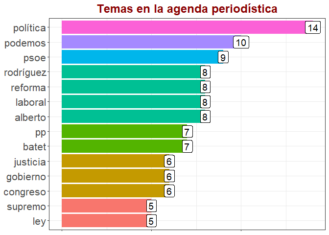

# Web Scraping en R con el paquete rvest

## ¿Qué es el Web Scraping?

Se denomina ‘web scraping’ (en inglés = arañado o raspado web) a la
extracción (automatizada y dirigida) y almacenamiento computacional del
contenido de páginas web. La información raspada puede ser de diverso
tipo. Por ejemplo, contactos telefónicos, correo electrónico,
direcciones físicas, información censal, notas periodísticas o de
opinión, comentarios de lectorxs, precios, etc. Esta información se
almacena en formatos diversos: vectores lógicos, numéricos o de texto
plano, marcos de datos, tablas, listas, matrices, arrays. Los objetos de
clase arrays son poco usuales. En este encuentro nos vamos a centrar en
los objetos de tipo tabular (tibbles y data frames). También usaremos
objetos de clase lista y vector.

En términos generales, el web scraping toma información web
semi-estructurada y la devuelve en un formato estructurado. Como
dijimos, aquí usaremos el formato tibble.

## Web Scraping y el giro digital

En las últimas dos décadas el crecimiento de la información online se
dio de forma acelerada, al punto de tornar imprescindible el uso del
raspado web para la recuperación masiva de parte de esa información
nacida digital. Internet alberga una cantidad infinita de datos
“extraibles”. Parte de esta información subyace en bases de datos,
detrás de API o en texto plano enmarcados en estructuras HTML/XML. Como
vimos en los encuentros anteriores, por distintas razones podemos querer
obtener información de redes sociales como Twitter o de foros de
usuarixs para ver qué está pensando la población sobre distintos temas y
tópicos. De todas formas, la accesibilidad no siempre está al alcance de
la mano, muchas páginas web bloquean el acceso mediante programación o
configuran “muros de pago” que requieren que se suscriba a una API para
acceder. Esto es lo que hacen, por ejemplo, *The New York Times* y *El
ABC*. Pero, finalmente, esas medidas no son una traba definitiva.
Existen muchas formas para obtener los datos que nos interesan.

## ¿Cuándo se usa el Web Scraping?

-   Cuando no hay un conjunto de datos disponible para la problemática
    que queremos abordar.
-   Cuando no hay una API (interfaz de programación de aplicaciones)
    pública disponible que permita un intercambio fluido con los datos
    que necesitamos recopilar. Si el sitio web ofrece una API que
    contiene la información que necesitamos, utilizarla es lo más
    ventajoso. Las APIs permiten recopilar datos en forma rápida y
    directa desde la base de datos detrás del sitio web que tiene la
    información que nos interesa.

Puede ocurrir que algunos sitios tengan información en formatos
inusuales que los hace más difíciles de recopilar. Vale la pena
verificar si puede descargar y extraer información de una sola página
antes de lanzar un raspado completo del sitio web.

## El Web Scraping y su legalidad

En términos generales, el raspado web (no comercial) de información
publicada en la web y de acceso público no es ilegal. Sin embargo,
existen protocolos de buenas prácticas de raspado que debemos intentar
respetar por cuestiones éticas. Para más detalles sobre este asunto
pueden leer los siguientes artículos: James Phoenix (2020) [‘Is Web
Scraping Legal?’](https://understandingdata.com/is-web-scraping-legal/),
Tom Waterman (2020) [‘Web scraping is now
legal’](https://medium.com/@tjwaterman99/web-scraping-is-now-legal-6bf0e5730a78),
Krotov, V., Johnson, L., & Silva, L. (2020) [‘Tutorial: Legality and
Ethics of Web
Scraping’](https://aisel.aisnet.org/cgi/viewcontent.cgi?article=4240&context=cais),
Edward Roberts (2018) [‘Is Web Scraping Illegal? Depends on What the
Meaning of the Word
Is’](https://www.imperva.com/blog/is-web-scraping-illegal/).

## ¿Para qué hacer Web Scraping?

Los usos del raspado web son infinitamente variados. Todo depende del
problema que queramos resolver. Puede ser la recuperación de la serie
histórica de precios de los pasajes de autobús en la ciudad de Mar del
Plata. O el análisis de las tendencias actuales en las agendas
periodísticas en la prensa española. Quizás la detección de cambios en
el lenguaje a lo largo del tiempo referido al uso del lenguaje
inclusivo, por ejemplo. O el monitoreo del humor social en determinado
lugar y tiempo en torno a tópicos políticos, sociales, culturales o
económicos. Etcétera. Etcétera. Etcétera. O el análisis de la
conflictividad social visibilizada en la prensa online, que es lo que
nos ocupa.

Todo esto es independiente de la herramienta que usemos para hacer el
raspado web. Pero no es así en este TalleR 😉.

## ¿Cómo hacer Web Scraping en R?

Esta pregunta la vamos a responder con un enfoque práctico, gracias a
las funciones del paquete `rvest`.

Lo primero que vamos a hacer es activar los paquetes que vamos a
utilizar a lo largo de los ejercicios. El primero de los ejercicios nos
permitirá desarrollar una función de web scraping. En este caso
aplicaremos la función creada a un diario español: *El Mundo*. La
función nos permitirá quedarnos con los titulares de una de sus
secciones. Luego analizaremos esos titulares con técnicas de
tonkenización y, finalmente, visualizaremos los resultados con `ggplot2`
que nos devolverá un gráfico de barras con las palabras más frecuentes.
Esto nos permitirá tener un primer pantallazo sobre la agenda
periodística del periódico en cuestión. Sin más preámbulo, pasemos la
primer ejercicio.

### Ejercicio 1

¿Cuáles son los tópicos más importantes de la agenda del diario *El
Mundo* según las últimas notas de su sección ‘España’? Veamos:

    # Pueden copiar y pegar el script o descargarlo desde RStudio con esta línea de comando:
    # utils::download.file("https://estudiosmaritimossociales.org/ejercicio01.R", "ejercicio01.R")
    # Paquetes a cargar (función 'require()' es equivalente a la función 'library()') ----------------
    require(tidyverse)
    require(rvest)
    require(stringr)
    require(tidytext)
    # Creamos la función para raspar El Mundo cuyo nombre será 'scraping_EM()' ------------------------
    scraping_EM <- function (x){          # abro función para raspado web y le asigno un nombre: scraping_EM
      
      rvest::read_html(x) %>%             # llamo a la función read_html() para obtener el contenido de la página
        
        rvest::html_elements(".ue-c-cover-content__headline-group") %>%  # llamo a la función html_elements() y especifico las etiquetas de los títulos 
        
        rvest::html_text() %>%            # llamo a la función html_text() para especificar el formato 'chr' del título.
        
        tibble::as_tibble() %>%           # llamo a la función as_tibble() para transforma el vector en tabla 
        
        dplyr::rename(titulo = value)     # llamo a la función rename() para renombrar la variable 'value'
      
    }                                     # cierro la función para raspado web
    # Usamos la función para scrapear el diario El Mundo ----------------------------------------------
    (El_Mundo <- scraping_EM("https://www.elmundo.es/espana.html"))

    ## # A tibble: 65 x 1
    ##    titulo                                                                       
    ##    <chr>                                                                        
    ##  1 "Política. La anulación del impuesto de plusvalía amenaza los Presupuestos d~
    ##  2 "Política. Moncloa quiere tutelar la negociación de la reforma laboral senta~
    ##  3 "Política. La coalición de los líos: Unidas Podemos ataca por tierra, mar y ~
    ##  4 "A contrapelo. Dejadme los anuncios"                                         
    ##  5 "Terrorismo. Las víctimas del terrorismo confían en la misión de la UE sobre~
    ##  6 "Justicia. La Ley de plurilingüismo, camino por primera vez de los tribunale~
    ##  7 "Justicia. Alberto Rodríguez acusa a Batet ante el Supremo de \"modificar\" ~
    ##  8 "Congreso. El PSOE desata el malestar de sus aliados retrasando de nuevo la ~
    ##  9 "Cataluña. ERC abandona a Borràs en su intento de blindarse ante una inhabil~
    ## 10 "Política. Unidas Podemos se opone al PSOE en todos los frentes y acusa al j~
    ## # ... with 55 more rows

    # Tokenizamos los títulos de la sección 'España' del periódico El Mundo ---------------------------
    El_Mundo %>%                                          # datos en formato tabular extraídos con la función scraping_EM()
      
      tidytext::unnest_tokens(                            # función para tokenizar
        
        palabra,                                          # nombre de la columna a crear
        
        titulo) %>%                                       # columna de datos a tokenizar
      
      dplyr::count(                                       # función para contar
        
        palabra) %>%                                      # columna de datos a contar
      
      dplyr::arrange(                                     # función para ordenar columnas
        
        dplyr::desc(                                      # orden decreciente
          
          n)) %>%                                         # columna de frecuencia a ordenar en forma decreciente
      
      dplyr::filter(n > 4) %>%                            # filtramos y nos quedamos con las frecuencias mayores a 2
      
      dplyr::filter(!palabra %in% 
                      tm::stopwords("es")) %>%            # filtramos palabras comunes
      
      dplyr::filter(palabra != "españa") %>%              # filtro comodín
      
      dplyr::filter(palabra != "años") %>%                # filtro comodín
      
      ggplot2::ggplot(                                    # abrimos función para visualizar
        
        ggplot2::aes(                                     # definimos el mapa estético del gráfico
          
          y = n,                                          # definimos la entrada de datos de y
          
          x = stats::reorder(                             # definimos la entrada de datos de x
            
            palabra,                                      # con la función reorder() 
            
            + n                                           # para ordenar de mayor a menos la frecuencia de palabras
            
          )                                               # cerramos la función reorder()
          
        )                                                 # cerramos la función aes()
        
      ) +                                                 # cerramos la función ggplot()
      
      ggplot2::geom_bar(                                  # abrimos la función geom_bar()
        
        ggplot2::aes(                                     # agregamos parámetros a la función aes()
          
          fill = as_factor(n)                             # definimos los colores y tratamos la variable n como factores
          
        ),                                                # cerramos la función aes()
        
        stat = 'identity',                                # definimos que no tiene que contar, que los datos ya están agrupados 
        
        show.legend = F) +                                # establecemos que se borre la leyenda
      
      ggplot2::geom_label(                                # definimos las etiquetas de las barras
        
        aes(                                              # agregamos parámetros a la función aes()
          
          label = n                                       # definimos los valores de ene como contenido de las etiquetas
          
        ),                                                # cerramos la función aes()
        
        size = 5) +                                       # definimos el tamaño de las etiquetas
      
      ggplot2::labs(                                      # definimos las etiquetas del gráfico
            
        title = "Temas en la agenda periodística",        # definimos el título
        
        x = NULL,                                         # definimos la etiqueta de la x
        
        y = NULL                                          # definimos la etiqueta de la y
        
      ) +                                                 # cerramos la función labs()
      
      ggplot2::coord_flip() +                             # definimos que las barras estén acostadas                     
      
      ggplot2::theme_bw() +                               # definimos el tema general del gráfico
      
      ggplot2::theme(                                     # definimos parámetros para los ejes
        
        axis.text.x = 
          ggplot2::element_blank(),                       # definimos que el texto del eje x no se vea
        
        axis.text.y = 
          ggplot2::element_text(                          # definimos que el texto del eje y 
            
            size = 16                                     # definimos el tamaño del texto del eje y
            
          ),                                              # cerramos la función element_text()
        
        plot.title = 
          ggplot2::element_text(                          # definimos la estética del título
            
            size = 18,                                    # definimos el tamaño
            
            hjust = .5,                                   # definimos la alineación 
            
            face = "bold",                                # definimos el grosor de la letra
            
            color = "darkred"                             # definimos el color de la letra
            
          )                                               # cerramos la función element_text()
        
      )                                                   # cerramos la función theme()

Parece que durante los últimos días los temas centrales fueron la covid,
las políticas publicas en torno al coronavirus (toque de queda,
restricciones, confinamiento), disputas políticas entre el gobierno y la
oposición.

### Ejercicio 2

Gracias al Ejercicio 1 tenemos una idea general sobre cómo y para qué
hacer web scraping. En el ejercicio 1 hicimos todo en uno, desde la
extracción hasta la visualización. Ahora nos ocuparemos de ir paso a
paso. Además, haremos un raspado un poco más profundo.

Arranquemos por la función de web scraping:

    # Pueden copiar y pegar o descargarlo desde RStudio con esta línea de comando:
    # utils::download.file("https://estudiosmaritimossociales.org/ejercicio02.R", "ejercicio02.R")
    # Paquetes a cargar (función 'require()' es equivalente a la función 'library()') ----------------
    require(dplyr)
    require(rvest)
    require(tibble)
    # Creamos la función para raspar El País cuyo nombre será 'scraping_links()' ---------------------
    scraping_links <- function(pag_web, tag_link) {   # abro función para raspado web y le asigno un nombre: scraping_links.
      
      rvest::read_html(pag_web) %>%                   # llamo a la función read_html() para obtener el contenido de la página.
        
        rvest::html_elements(tag_link) %>%            # llamo a la función html_elements() y especifico las etiquetas de los títulos 
        
        rvest::html_attr("href") %>%                  # llamo a la función html_attr() para especificar el formato 'chr' del título.
        
        rvest::url_absolute(pag_web) %>%              # llamo a la función url::absolute() para completar las URLs relativas
        
        tibble::as_tibble() %>%                       # llamo a la función as_tibble() para transforma el vector en tabla
        
        dplyr::rename(link = value)                   # llamo a la función rename() para renombrar la variable 'value'
      
    }                                                 # cierro la función para raspado web
    # Usamos la función para scrapear el diario El Mundo ----------------------------------------------
    (links_EM <- scraping_links(pag_web = "https://www.elmundo.es/economia.html", tag_link = "a.ue-c-cover-content__link"))

    ## # A tibble: 65 x 1
    ##    link                                                                         
    ##    <chr>                                                                        
    ##  1 https://www.elmundo.es/economia/macroeconomia/2021/10/27/61781ec621efa0576d8~
    ##  2 https://www.elmundo.es/ciencia-y-salud/medio-ambiente/2021/10/27/61782618fdd~
    ##  3 https://www.elmundo.es/economia/empresas/2021/10/27/6177f02afdddff39678b45a6~
    ##  4 https://www.elmundo.es/economia/actualidad-economica/2021/10/27/616fe68ee4d4~
    ##  5 https://www.elmundo.es/economia/2021/10/27/6178506dfdddff22178b459f.html     
    ##  6 https://www.elmundo.es/ciencia-y-salud/medio-ambiente/2021/10/27/617819fc21e~
    ##  7 https://www.elmundo.es/economia/2021/10/26/6178322921efa0c12d8b4579.html     
    ##  8 https://www.elmundo.es/economia/ahorro-y-consumo/2021/10/26/6177f2e1fdddff91~
    ##  9 https://www.elmundo.es/economia/2021/10/26/6177df70fc6c83fa368c0240.html     
    ## 10 https://www.elmundo.es/economia/empresas/2021/10/26/6177caacfc6c8306268b45dd~
    ## # ... with 55 more rows

    # Usamos la función para scrapear el diario El País -----------------------------------------------
    (links_EP <- scraping_links(pag_web = "https://elpais.com/espana/", tag_link = "h2 a")) 

    ## # A tibble: 59 x 1
    ##    link                                                                         
    ##    <chr>                                                                        
    ##  1 https://elpais.com/espana/catalunya/2021-10-27/el-estado-mayor-del-independe~
    ##  2 https://elpais.com/espana/catalunya/2021-10-27/el-norteamericano-que-se-colo~
    ##  3 https://elpais.com/espana/2021-10-27/las-instituciones-siguen-su-marcha-entr~
    ##  4 https://elpais.com/opinion/2021-10-25/o-belarra-rectifica-o-mejor-que-se-vay~
    ##  5 https://elpais.com/opinion/2021-10-24/tanto-esperar-para-esto.html           
    ##  6 https://elpais.com/opinion/2021-10-22/espana-y-la-mala-memoria.html          
    ##  7 https://elpais.com/opinion/2021-10-14/los-dilemas-del-psoe-redefinir-el-prog~
    ##  8 https://elpais.com/opinion/2021-10-11/mas-autonomia-estrategica.html         
    ##  9 https://elpais.com/espana/2021-10-26/el-gobierno-acepta-que-trabajo-lidere-l~
    ## 10 https://elpais.com/economia/2021-10-26/la-temporalidad-y-los-convenios-los-g~
    ## # ... with 49 more rows

Cumplido el primer paso (la obtención de los links a las notas
completas), nos toca construir una función para ‘raspar’ el contenido
completo de cada nota. ¡Manos a la obra!

    # Paquetes a cargar (función 'require()' es equivalente a la función 'library()') ----------------
    require(dplyr)
    require(rvest)
    require(tibble)
    # Creamos la función para raspar El País cuyo nombre será 'scraping_links()' ---------------------
    scraping_notas <- function(pag_web, tag_fecha, tag_titulo, tag_nota) { # abro función para raspado web: scraping_notas().
      
      tibble::tibble(                               # llamo a la función tibble.
      
      fecha = rvest::html_elements(                 # declaro la variable fecha y llamo a la función html_elements().
        
        rvest::read_html(pag_web), tag_fecha) %>%   # llamo a la función read_html(pag_web) y especifico la(s) etiqueta(s) de la fecha. 
        
        rvest::html_text(),                         # llamo a la función html_text() para especificar el formato 'chr' de la fecha.
      
      titulo = rvest::html_elements(                # declaro la variable titulo y llamo a la función html_elements().
        
        rvest::read_html(pag_web), tag_titulo) %>%  # llamo a la función read_html(pag_web) y especifico la(s) etiqueta(s) del titulo.  
        
        rvest::html_text(),                         # llamo a la función html_text() para especificar el formato 'chr' del título.
      
      nota = rvest::html_elements(                  # declaro la variable nota y llamo a la función html_elements(). 
        
        rvest::read_html(pag_web), tag_nota) %>%    # llamo a la función html_elements() y especifico la(s) etiqueta(s) de la nota. 
        
        rvest::html_text()                          # llamo a la función html_text() para especificar el formato 'chr' del título.
      
      )                                             # cierro la función tibble().
      
    }                                               # cierro la función para raspado web.
    # Usamos la función para scrapear las notas del diario El País u otras páginas web ---------------------------
    (notas_EP  <- scraping_notas(pag_web = "https://elpais.com/espana/2021-01-16/madrid-una-semana-enterrada-en-la-nieve.html", 
                                 tag_fecha = ".a_ti",
                                 tag_titulo = "h1",
                                 tag_nota = ".a_b")) 

    ## # A tibble: 0 x 3
    ## # ... with 3 variables: fecha <chr>, titulo <chr>, nota <chr>

Resultó bien, pero ya tenemos un primer problema de normalización: el
formato de la fecha. Cuando miramos el tibble vemos que la variable
fecha es identificada y tratada como de tipo ‘chr’ (caracter). Debemos
transformarla en una variable de tipo ‘date’ (fecha). ¿Cómo lo hacemos?
Hay muchas formas. Acá vamos a hacerlo en dos pasos. Primero vamos a
quedarnos con los 11 caracteres iniciales (“dd mmm yyyy”) y luego
removemos los restantes. Finalmente, transformamos esos 11 caracteres en
un valor ‘date’ con la función `dmy()` del paquete `lubridate` de
`tidyverse`. Veamos cómo…

    # Paquetes a cargar (función 'require()' es equivalente a la función 'library()') ----------------
    require(lubridate)
    require(stringr)
    require(magrittr)
    fecha_sin_normalizar <- "16 ene 2021 - 23:30 UTC"   # creamos el objeto 'fecha_sin_normalizar'.
    (stringr::str_sub(fecha_sin_normalizar, 1, 11) %>%  # llamamos a la función str_sub() para quedarnos con los primeros 11 caracteres.   
      
      stringr::str_replace_all("ene", "jan") %>%        # llamamos a la función str_remplace_all() para cambiar la denominación de los mes.             
      stringr::str_replace_all("abr", "apr") %>% 
      stringr::str_replace_all("ago", "aug") %>% 
      stringr::str_replace_all("dic", "dec") %>% 
      
      lubridate::dmy() -> fecha_normalizada)            # finalmente llamamos a la función dmy() para transformar el string en un valor tipo 'date'.

    ## [1] "2021-01-16"

    base::class(fecha_normalizada)                      # examinamos su clase.

    ## [1] "Date"

Bien. Hemos logrado transformar la cadena de caracteres que contenía la
fecha en un valor que R reconoce y trata como ‘date’. Sin embargo,
seguimos con un problema no menor. Pudimos recuperar con al función
scraping\_notas() el contenido de una nota, pero la idea es recuperar el
contenido de un set completo de notas. Para lograrlo tendremos que hacer
uso de una nueva función de la familia tidyverse que perteneciente al
paquete `purrr`. Nos referimos a la función `pmap_dfr()`. Esta función
es una variante de la función `map()` de `purrr` que itera sobre
múltiples argumentos simultáneamente y en paralelo.

    # Paquetes a cargar (función 'require()' es equivalente a la función 'library()') ----------------
    require(dplyr)
    require(rvest)
    require(tibble)
    require(purrr)
    # Creamos la función para raspar los links a las notas cuyo nombre será 'scraping_links()' -------
    scraping_links <- function(pag_web, tag_link) {   # abro función para raspado web y le asigno un nombre: scraping_links
      
      rvest::read_html(pag_web) %>%                   # llamo a la función read_html() para obtener el contenido de la página
        
        rvest::html_elements(tag_link) %>%            # llamo a la función html_elements() y especifico las etiquetas de los títulos 
        
        rvest::html_attr("href") %>%                  # llamo a la función html_attr() para especificar el formato 'chr' del título.
        
        rvest::url_absolute(pag_web) %>%              # llamo a la función url::absolute() para completar las URLs relativas
        
        tibble::as_tibble() %>%                       # llamo a la función as_tibble() para transforma el vector en tabla
        
        dplyr::rename(link = value)                   # llamo a la función rename() para renombrar la variable 'value'
      
    }                                                 # cierro la función para raspado web
    # Usamos la función para scrapear los links a las notas de El País -------------------------------
    (links_EP  <- scraping_links(pag_web = "https://elpais.com/espana/", tag_link = "h2 a")) 

    ## # A tibble: 59 x 1
    ##    link                                                                         
    ##    <chr>                                                                        
    ##  1 https://elpais.com/espana/catalunya/2021-10-27/el-estado-mayor-del-independe~
    ##  2 https://elpais.com/espana/catalunya/2021-10-27/el-norteamericano-que-se-colo~
    ##  3 https://elpais.com/espana/2021-10-27/las-instituciones-siguen-su-marcha-entr~
    ##  4 https://elpais.com/opinion/2021-10-25/o-belarra-rectifica-o-mejor-que-se-vay~
    ##  5 https://elpais.com/opinion/2021-10-24/tanto-esperar-para-esto.html           
    ##  6 https://elpais.com/opinion/2021-10-22/espana-y-la-mala-memoria.html          
    ##  7 https://elpais.com/opinion/2021-10-14/los-dilemas-del-psoe-redefinir-el-prog~
    ##  8 https://elpais.com/opinion/2021-10-11/mas-autonomia-estrategica.html         
    ##  9 https://elpais.com/espana/2021-10-26/el-gobierno-acepta-que-trabajo-lidere-l~
    ## 10 https://elpais.com/economia/2021-10-26/la-temporalidad-y-los-convenios-los-g~
    ## # ... with 49 more rows

    # Creamos la función para raspar El País cuyo nombre será 'scraping_links()' ---------------------
    scraping_notas <- function(pag_web, tag_fecha, tag_titulo, tag_nota) { # abro función para raspado web: scraping_notas().
      
      tibble::tibble(                               # llamo a la función tibble.
      
      fecha = rvest::html_elements(                 # declaro la variable fecha y llamo a la función html_elements().
        
        rvest::read_html(pag_web), tag_fecha) %>%   # llamo a la función read_html(pag_web) y especifico la(s) etiqueta(s) de la fecha. 
        
        rvest::html_text(),                         # llamo a la función html_text() para especificar el formato 'chr' de la fecha.
      
      titulo = rvest::html_elements(                # declaro la variable titulo y llamo a la función html_elements().
        
        rvest::read_html(pag_web), tag_titulo) %>%  # llamo a la función read_html(pag_web) y especifico la(s) etiqueta(s) del titulo.  
        
        rvest::html_text(),                         # llamo a la función html_text() para especificar el formato 'chr' del título.
      
      nota = rvest::html_elements(                  # declaro la variable nota y llamo a la función html_elements(). 
        
        rvest::read_html(pag_web), tag_nota) %>%    # llamo a la función html_elements() y especifico la(s) etiqueta(s) de la nota. 
        
        rvest::html_text()                          # llamo a la función html_text() para especificar el formato 'chr' del título.
      
      )                                             # cierro la función tibble().
      
    }                                               # cierro la función para raspado web.
    # Seleccionamos los links que refieren a la sección que nos interesa y nos quedamos solo con 10 notas --------
    (links_EP_limpio <- links_EP %>% filter(str_detect(link, "https://elpais.com/espana/")) %>% filter(!str_detect(link,"en-clave-de-bienestar")) %>% .[1:10,])

    ## # A tibble: 10 x 1
    ##    link                                                                         
    ##    <chr>                                                                        
    ##  1 https://elpais.com/espana/catalunya/2021-10-27/el-estado-mayor-del-independe~
    ##  2 https://elpais.com/espana/catalunya/2021-10-27/el-norteamericano-que-se-colo~
    ##  3 https://elpais.com/espana/2021-10-27/las-instituciones-siguen-su-marcha-entr~
    ##  4 https://elpais.com/espana/2021-10-26/el-gobierno-acepta-que-trabajo-lidere-l~
    ##  5 https://elpais.com/espana/2021-10-26/la-calle-suaviza-la-gresca-politica-sob~
    ##  6 https://elpais.com/espana/2021-10-26/un-capitan-falsifico-la-firma-de-su-jef~
    ##  7 https://elpais.com/espana/2021-10-26/podemos-y-psoe-se-dan-otra-semana-para-~
    ##  8 https://elpais.com/espana/2021-10-26/el-gobierno-de-navarra-llega-a-un-preac~
    ##  9 https://elpais.com/espana/2021-10-26/iu-vuelve-a-pedir-al-juez-del-caso-puni~
    ## 10 https://elpais.com/espana/comunidad-valenciana/2021-10-26/cae-una-trama-fami~

    # Usamos la función pmap_dfr() para emparejar los links y la función de web scraping y creamos el objeto el_pais_esp con las 10 notas completas
    (el_pais_esp <-                     # abrimos la función print '(' y asignamos un nombre al objeto que vamos a crear.
        
        purrr::pmap_dfr(                # llamamos a la función pmap_dfr() para emparejar links y función de rascado.
          
          base::list(                   # Llamamos a la función list() para crear una lista con los múltiples argumentos de la función de rascado.
            
            links_EP_limpio$link,       # vector de links.
            
            ".a_ti",                    # etiqueta de fecha.
            
            "h1",                       # etiqueta de título.
            
            ".a_b"),                    # etiqueta de nota y cierro la función list().
          
          scraping_notas))              # función scraping_notas() sin los `()` y cierro la función pmap_dfr() y la función print `)`.

    ## # A tibble: 0 x 3
    ## # ... with 3 variables: fecha <chr>, titulo <chr>, nota <chr>

    # Usamos la función para scrapear los links a las notas de La Nación -------------------------------
    (links_LN <- scraping_links(pag_web = "https://www.lanacion.com.ar/politica", tag_link = "h2 a"))

    ## # A tibble: 30 x 1
    ##    link                                                                         
    ##    <chr>                                                                        
    ##  1 https://www.lanacion.com.ar/politica/la-camara-de-diputados-se-apresta-a-con~
    ##  2 https://www.lanacion.com.ar/politica/maria-eugenia-vidal-le-contesto-a-marti~
    ##  3 https://www.lanacion.com.ar/politica/leandro-santoro-sobre-el-conflicto-mapu~
    ##  4 https://www.lanacion.com.ar/politica/el-oficialismo-freno-la-ficha-limpia-en~
    ##  5 https://www.lanacion.com.ar/politica/nadie-sabe-que-hara-la-vicepresidenta-n~
    ##  6 https://www.lanacion.com.ar/politica/desde-el-pro-denunciaron-que-en-un-cole~
    ##  7 https://www.lanacion.com.ar/politica/en-plena-campana-el-intendente-de-la-pl~
    ##  8 https://www.lanacion.com.ar/politica/el-detras-de-escena-de-la-primera-excur~
    ##  9 https://www.lanacion.com.ar/politica/washington-marca-la-cancha-antes-de-un-~
    ## 10 https://www.lanacion.com.ar/politica/juicio-contra-cristina-kirchner-un-empr~
    ## # ... with 20 more rows

    # Usamos la función para scrapear las notas de La Nación. Replicamos todo en una sola línea de código.
    (la_nacion_ar <- purrr::pmap_dfr(list(links_LN$link[1:10],".com-date.--twoxs",".com-title.--threexl",".col-12 p"), scraping_notas)) # "section.fecha","h1.titulo","#cuerpo p" scraping_notas))

    ## # A tibble: 135 x 3
    ##    fecha                 titulo                      nota                       
    ##    <chr>                 <chr>                       <chr>                      
    ##  1 27 de octubre de 2021 La Cámara de Diputados con~ Tras varias horas de inten~
    ##  2 27 de octubre de 2021 La Cámara de Diputados con~ El proyecto, que obtuvo me~
    ##  3 27 de octubre de 2021 La Cámara de Diputados con~ El oficialismo, en la voz ~
    ##  4 27 de octubre de 2021 La Cámara de Diputados con~ “Con esta ley vamos a subi~
    ##  5 27 de octubre de 2021 La Cámara de Diputados con~ En la misma línea, la dipu~
    ##  6 27 de octubre de 2021 La Cámara de Diputados con~ En la vereda contraria, lo~
    ##  7 27 de octubre de 2021 La Cámara de Diputados con~ “Debemos pensar en un sist~
    ##  8 27 de octubre de 2021 La Cámara de Diputados con~ El diputado y presidente d~
    ##  9 27 de octubre de 2021 La Cámara de Diputados con~ “En general, es un proyect~
    ## 10 27 de octubre de 2021 La Cámara de Diputados con~ La bancada de Juntos por e~
    ## # ... with 125 more rows

    # Guardamos el objeto 'la_nacion_ar' como objeto .rds
    base::saveRDS(la_nacion_ar, "la_nacion_ar.rds")

Bueno, parece que finalmente realizamos todos los pasos para hacer un
web scraping completo. Pero esto no termina aquí. Seguro notaron que las
notas se trasformaron de 10 a 100, esto puede ser contraproducente en el
momento del análisis. Tenemos que normalizar la base. ¡Hagámoslo!

    # Paquetes a cargar (función 'require()' es equivalente a la función 'library()') ----------------
    require(dplyr)
    require(rvest)
    require(tibble)
    require(stringr)
    require(tidyr)
    require(lubridate)
    # Cargamos el objeto la_nacion_ar.
    la_nacion_ar <- base::readRDS("la_nacion_ar.rds")
    # Imprimimos en consola sus valores completos, las notas completas.
    la_nacion_ar$nota[1:30] # los corchetes me permiten seleccionar los valores según su número de fila

    ##  [1] "Tras varias horas de intenso debate, la Cámara de Diputados convirtió esta noche en ley el proyecto que obliga a los productores de alimentos envasados a incluir un esquema de etiquetado frontal con octógonos negros que adviertan sobre los excesos en materia de azúcares, sodio, calorías y de grasas saturadas y totales."                                                                                                                                                                                                                                                                                                                                      
    ##  [2] "El proyecto, que obtuvo media sanción del Senado hace un año, se aprobó con 200 votos positivos frente a 22 negativos y 16 abstenciones. Si bien la mayoría de los legisladores apoyó en términos generales la iniciativa, varios plantearon objeciones y se abstuvieron de votar algunos de sus artículos. Otro grupo de diputados –en su mayoría de Pro– rechazaron la iniciativa por considerar que el esquema de octógonos previsto en la iniciativa resulta “hostil y estigmatizante” y que, en lugar de propender hacia una educación en materia alimentaria, impone censuras y prohibiciones."                                                                  
    ##  [3] "El oficialismo, en la voz de la presidenta de la Comisión de Legislación General, Cecilia Moreau, defendió la iniciativa y retrucó los cuestionamientos a la ley, al enfatizar que no prohibirá la comercialización de ningún producto."                                                                                                                                                                                                                                                                                                                                                                                                                               
    ##  [4] "“Con esta ley vamos a subir un escalón en la prevención de la salud y en garantizar los derechos de todos los argentinos. El octógono negro de advertencia es la forma más eficaz de comunicar la presencia o ausencia en nutrientes críticos en los alimentos. Hoy estamos rodeados de productos ultraprocesados con exceso en grasas, sal y azúcares. Las etiquetas son engañosas y a veces ilegibles; los consumidores tienen el derecho a saber qué es lo que está consumiendo e ingiriendo”, enfatizó la legisladora, quien advirtió que el 66% de la población en nuestro país tiene sobrepeso y el 32% padece obesidad, mientras que el 42% sufre presión alta."
    ##  [5] "En la misma línea, la diputada oficialista Liliana Schwindt enfatizó que esta ley es de salud pública, pues apunta a prevenir enfermedades como la diabetes, la hipertensión y la obesidad. “Constituyen una pandemia silenciosa”, advirtió."                                                                                                                                                                                                                                                                                                                                                                                                                          
    ##  [6] "En la vereda contraria, los diputados Carmen Polledo y Alejandro García, de Pro, anticiparon fuertes críticas al proyecto. “Comparto la idea general del proyecto de promover una alimentación saludable de los productos que consume la población –sostuvo Polledo–. Su objetivo es poner en cada paquete un octógono negro por cada nutriente crítico que excede el límite sugerido y prohibir que se informen sobre las cualidades positivas que este contenga. Hay una posición de fanatismo de imponer de que hay una sola forma posible de etiquetado, cuando no la hay”."                                                                                       
    ##  [7] "“Debemos pensar en un sistema de etiquetado integral y completo. El cambio se construye educando y no se impone por la fuerza, nadie está autorizado para modificar ni dirigir los hábitos de los demás”, enfatizó."                                                                                                                                                                                                                                                                                                                                                                                                                                                   
    ##  [8] "El diputado y presidente de la Comisión de Acción Social y Salud, el oficialista Pablo Yedlin, admitió que, por su condición de tucumano y oriundo de una provincia azucarera, le resultó difícil pronunciarse sobre esta ley. “El azúcar es un elemento que puede derivar en el sobrepeso, pero no es un veneno, en absoluto. Muchos edulcorantes tendrán que explicar cuán saludables son. Igualmente voy a votar a favor, pero no debe creerse que con los octógonos negros se va solucionar el sobrepeso y la obesidad. Eso no fue demostrado en Chile y México, donde rige el etiquetado frontal”, sostuvo."                                                      
    ##  [9] "“En general, es un proyecto virtuoso y pudo haber sido mejorado”, sostuvo Yedlin, quien propuso que el nuevo rotulado solo sea incorporado en los alimentos procesados y ultraprocesados y que queden eximidos los productos dietarios y los destinados a la lactancia."                                                                                                                                                                                                                                                                                                                                                                                               
    ## [10] "La bancada de Juntos por el Cambio se mostró dividida. Mientras el grueso del radicalismo y de la Coalición Cívica apoyaban la iniciativa, la mayoría de los diputados de Pro se inclinaba por votar en contra."                                                                                                                                                                                                                                                                                                                                                                                                                                                       
    ## [11] "“Es una iniciativa que busca dar paso a una transformación en los hábitos alimentarios para hacerlos más saludables –destacó la radical Brenda Austin-. De más está decir que la etiqueta actual es absolutamente insuficiente. Apenas un tercio de las personas las leen y la mitad de los que la leen las entienden”."                                                                                                                                                                                                                                                                                                                                               
    ## [12] "Desde la Coalición Cívica, Mariana Stilman dijo que esta ley, de ser aprobada, va en línea con lo que establece el artículo 42 de la Constitución Nacional. “Venimos a cumplir con el mandato constitucional que propicia el derecho a la alimentación saludable, información adecuada y veraz y libertad de elección y de los consumidores”, sostuvo."                                                                                                                                                                                                                                                                                                                
    ## [13] "Desde Pro, una de las pocas voces a favor del proyecto fue la de la diputada Gisela Scaglia. “Hoy las etiquetas son algo similar a un jeroglífico: tipografía pequeña casi ilegible. Este rotulado va en contra de nuestro derecho constitucional a la salud y al acceso a la información. Hoy vamos a cambiarlo para empezar a ser conscientes de lo que consumimos y terminar con el engaño”, enfatizó."                                                                                                                                                                                                                                                             
    ## [14] "En contra del proyecto se pronunciaron las diputadas tucumana Beatriz Ávila (Justicia Social) e Ingrid Jetter (Pro). “Los tucumanos hemos sufrido mucho la agresión a nuestra industria madre, la azucarera, que le da trabajo a más de 30.000 personas. Este etiquetado negro remite a la muerte; pretender decir que el consumo de azúcar es similar al de la nicotina o a las grasas saturadas es insostenible. Por eso me pregunto cuáles son los intereses que motivan este proyecto”, advirtió Ávila."                                                                                                                                                           
    ## [15] "“Esta ley es imperfecta e inútil -sostuvo Jetter-. El octógono informa sobre el exceso de determinado nutriente crítico, pero no en cuanto. Además, los productos con octógonos negros no pueden brindar información adicional sobre cualidades que puede tener ese producto”."                                                                                                                                                                                                                                                                                                                                                                                        
    ## [16] "Sobre el final, Graciela Camaño (Consenso Federal) insistió en la necesidad de incorporar modificaciones a la media sanción del Senado. Advirtió que la norma no se armoniza con las regulaciones que al respecto rigen en los países en el Mercosur; asimismo, alertó que la iniciativa tampoco explicita cuáles serán los alimentos sujetos al nuevo etiquetado, si todos los alimentos o sólo los productos procesados y ultraprocesados."                                                                                                                                                                                                                          
    ## [17] "“No se trata de hacer una revolución, simplemente se trata de instrumentar un buen etiquetado a los alimentos en la Argentina. Si ese es el objetivo y, al mismo tiempo, pretendemos preservar las fuentes de trabajo, dejémonos de jorobar con todos estos discursos pirotécnicos que sostienen que si no votás esta ley sos parte de un lobby. Somos un país del tercer mundo; no nos podemos dar el lujo de cerrar ningún puesto de trabajo más. Se me dirá que la reglamentación de la ley hará las correcciones que hacen falta; puede ser, pero estaremos renunciando a nuestra condición de legisladores”, enfatizó."                                           
    ## [18] "En términos generales, el proyecto de ley propone regular el etiquetado de los alimentos envasados al incorporar un esquema de rotulado que advierta cuando un determinado producto tenga exceso de nutrientes críticos en cinco categorías: grasas totales, grasas saturadas, sodio, azúcares y/o calorías. Para definir el umbral por sobre el cual se considera que un producto tiene nutrientes “en exceso”, la ley tomó como referencia el perfil de nutrientes diagramado por la Organización Panamericana de la Salud (OPS) que establece parámetros de consumo y alimentación."                                                                                
    ## [19] "Según esta iniciativa, las bebidas y los alimentos procesados deberán llevar octógonos negros de al menos un 5% del tamaño de la cara principal del envase cuando su composición supere un umbral mínimo en cada uno de estos componentes. Es decir, puede llevar uno o más sellos negros."                                                                                                                                                                                                                                                                                                                                                                            
    ## [20] "El objetivo es que el consumidor reconozca una advertencia sobre las características del producto. Chile (2016), Uruguay (2018), Perú (2019) y México (2020) son los países de la región con esquemas de advertencia similares al que se propone localmente."                                                                                                                                                                                                                                                                                                                                                                                                          
    ## [21] ""                                                                                                                                                                                                                                                                                                                                                                                                                                                                                                                                                                                                                                                                      
    ## [22] "María Eugenia Vidal cruzó este martes al ministro de Economía, Martín Guzmán, luego de que le achacara tener una “postura anti-Argentina” y lo calificó como “irresponsable”. La primera candidata a diputada de Juntos por el Cambio destacó, en ese sentido, el respaldo que recibió la oposición en las PASO del 12 de septiembre."                                                                                                                                                                                                                                                                                                                                 
    ## [23] "“La primera respuesta se la dieron los 9 millones de argentinos que nos votaron hace poco tiempo”, afirmó Vidal en declaraciones a A24. La exgobernadora bonaerense consideró desafortunado el término utilizado por el ministro de Economía."                                                                                                                                                                                                                                                                                                                                                                                                                         
    ## [24] "“La palabra anti-Argentina y la palabra golpe son palabras de la dictadura, las fuerzas democráticas no usamos estas palabras”, remarcó y agregó: “Es irresponsable. Los argentinos tenemos un acuerdo con la democracia”. Y agregó: “Me parece irresponsable utilizarlo en campaña y de manera tribunera”."                                                                                                                                                                                                                                                                                                                                                           
    ## [25] "En ese sentido, la candidata señaló que Guzmán, que “se dedica a atacar en forma intolerante a la oposición”, no da respuestas sobre los problemas graves” del país como el “50% de inflación”, “el 40% de pobreza” y mencionó que “10 millones de argentinos entre los que trabajan en negro y los que buscan trabajo”. Y recalcó: “Y no hay plan hace dos años”."                                                                                                                                                                                                                                                                                                    
    ## [26] "Vidal criticó el argumento oficialista sobre el tamaño de la deuda tomado por la administración de Cambiemos y las consecuencias que eso dejó para la economía argentina. Para la candidata opositora, los volúmenes de compromisos en moneda extranjero no son tan disímiles y aludió a “problemas estructurales”."                                                                                                                                                                                                                                                                                                                                                   
    ## [27] "“Cristina Fernández de Kirchner tomó 42.000 millones de dólares de deuda en su último mandato y gastó 30.000 millones de dólares de reservas. Eso da 72.000 millones de dólares” sostuvo y agregó: “Mauricio Macri tomó 70.000 millones de dólares”. A su vez, indicó: “Alberto Fernández lleva en lo que va de su mandato más de 30.000 millones de dólares.”."                                                                                                                                                                                                                                                                                                       
    ## [28] "De esta forma, Vidal se preguntó: ¿El problema es Macri o es el déficit?  ¿Vamos a encarar los problemas en serio o vamos a ver a quién le echamos la culpa?."                                                                                                                                                                                                                                                                                                                                                                                                                                                                                                         
    ## [29] "Por su parte, volvió a referirse a Guzmán y ratificó sus cuestionamientos a las críticas al congelamiento de precios. “Creo que el ministro se molestó porque dije que los congelamientos de precios no servían. Pero no porque lo diga María Eugenia Vidal, sino porque los hechos demuestran que desde 1970 hasta acá se hicieron en diez oportunidades en distintos gobiernos, de distinto signo político, y no funcionaron”, aseveró."                                                                                                                                                                                                                             
    ## [30] "En los últimos días, Martín Guzmán empezó a levantar el tono crítico de sus afirmaciones contra la oposición. “De un lado tenemos a Juntos por el Cambio que formó un acuerdo con el establishment en contra de los intereses del pueblo. Lo que hacen es tener una postura anti-Argentina”, afirmó el ministro de Economía en una reciente entrevista en C5N."

    # Detectamos que hay algunas filas que son recurrente y debemos borrar:
       # "Celdas vacías"
    # Con el uso del paquete stringr vamos a remover estos fragmentos de información no útil.
    (la_nacion_ar_limpia <- la_nacion_ar %>%                                  # creamos un nuevo objeto clase tibble.
        
        dplyr::mutate(nota = stringr::str_trim(nota)) %>%                     # con las funciones mutate() y str_trim() quitamos los espacios en blanco sobrantes.
        
        dplyr::filter(nota != ""))                                            # con la función filter() descartamos las celdas vacías.

    ## # A tibble: 125 x 3
    ##    fecha                 titulo                      nota                       
    ##    <chr>                 <chr>                       <chr>                      
    ##  1 27 de octubre de 2021 La Cámara de Diputados con~ Tras varias horas de inten~
    ##  2 27 de octubre de 2021 La Cámara de Diputados con~ El proyecto, que obtuvo me~
    ##  3 27 de octubre de 2021 La Cámara de Diputados con~ El oficialismo, en la voz ~
    ##  4 27 de octubre de 2021 La Cámara de Diputados con~ “Con esta ley vamos a subi~
    ##  5 27 de octubre de 2021 La Cámara de Diputados con~ En la misma línea, la dipu~
    ##  6 27 de octubre de 2021 La Cámara de Diputados con~ En la vereda contraria, lo~
    ##  7 27 de octubre de 2021 La Cámara de Diputados con~ “Debemos pensar en un sist~
    ##  8 27 de octubre de 2021 La Cámara de Diputados con~ El diputado y presidente d~
    ##  9 27 de octubre de 2021 La Cámara de Diputados con~ “En general, es un proyect~
    ## 10 27 de octubre de 2021 La Cámara de Diputados con~ La bancada de Juntos por e~
    ## # ... with 115 more rows

    # Ahora colapsaremos los párrafos de cada nota en una sola celda, de esta forma volveremos a un tibble de 10 filas (observaciones), una por nota.
    (la_nacion_ar_limpia_norm <- la_nacion_ar_limpia %>%                                # creamos un nuevo objeto clase tibble.
        
      dplyr::group_by(fecha, titulo) %>%                                                # con la función group_by() agrupamos por fecha y título.
        
      dplyr::summarise(nota_limpia = base::paste(nota, collapse = " ||| ")) %>%         # con las funciones summarise() y paste() colapsamos los párrafos.
      
      dplyr::select(fecha, titulo, nota_limpia) %>%                                     # con la función select() seleccionamos las variables. 
      
      dplyr::mutate(fecha = lubridate::dmy(fecha)))                                     # con las funciones mutate() y dmy() le damos formato date al string de fechas.

    ## # A tibble: 10 x 3
    ## # Groups:   fecha [2]
    ##    fecha      titulo                          nota_limpia                       
    ##    <date>     <chr>                           <chr>                             
    ##  1 2021-10-26 "Desde el PRO denunciaron que ~ "En medio de la situación de viol~
    ##  2 2021-10-26 "Detrás de escena de la primer~ "Facundo Manes se baja del auto y~
    ##  3 2021-10-26 "El Frente de Todos no quiso v~ "La coalición oficialista Frente ~
    ##  4 2021-10-26 "En plena campaña, el intenden~ "La República de los Niños de La ~
    ##  5 2021-10-26 "Juicio contra Cristina Kirchn~ "En una de las audiencias de mayo~
    ##  6 2021-10-26 "Leandro Santoro, sobre el con~ "El candidato a diputado nacional~
    ##  7 2021-10-26 "María Eugenia Vidal le contes~ "María Eugenia Vidal cruzó este m~
    ##  8 2021-10-26 "Nadie sabe qué hará la vicepr~ "Extrañamente, Martín Guzmán se c~
    ##  9 2021-10-26 "Washington marca la cancha an~ "Justo antes del viaje de Alberto~
    ## 10 2021-10-27 "La Cámara de Diputados convir~ "Tras varias horas de intenso deb~

    # Imprimimos en consola sus valores completos, las notas completas.
    la_nacion_ar_limpia_norm$nota_limpia[1:10] # los corchetes me permiten seleccionar los valores según su número de fila

    ##  [1] "En medio de la situación de violencia en la Patagonia, una denuncia de un concejal del partido PRO abrió una nueva polémica. El edil Marcelo Bermúdez denunció que alumnos de una escuela juraron en un mismo acto lealtad a la bandera argentina y también a la insignia utilizada por la comunidad mapuche. ||| Bermúdez comunicó a través de sus redes sociales que le envió una nota de protesta a la directora del establecimiento y demandó medidas a las autoridades educativas. ||| “Recientemente en la Escuela 182 de Neuquén se realizó el acto de Promesa a la Bandera por parte de los alumnos del nivel Primario. Pero en el mismo acto prometieron consignas a la bandera nacional y a la bandera mapuche. Le envié una nota de queja a la Directora”, apuntó el edil. ||| El dirigente opositor acompañó la publicación junto a una fotografía que representa la preparación del acto en el que se ven sillas vacías, un cartel con la frase “Sí, prometo”, y las banderas argentinas y de la comunidad mapuche. ||| Bermúdez sostuvo que cursará en los próximos días un pedido de informes a la ministra de Educación de la provincia, Cristina Storioni, “para que tome conocimiento de esta irregular situación”. ||| Recientemente en la Escuela 182 de Neuquen, se realizó el acto de Promesa a la Bandera por parte de los alumnos del nivel Primario. Pero en el mismo acto prometieron consignas a la Bandera Nacional y a la Bandera Mapuche. Le envié una nota de queja a la Directora. Abro Hilo pic.twitter.com/hQRgbHXd1A ||| La publicación generó discusión en Twitter. “No son banderas equivalentes. Una representa un Estado Nación y, otra, un Pueblo. La diferencia es notoria”, argumentó al responderle a un usuario que manifestó su disconformidad. ||| En ese sentido amplió: “Los mapuches tienen el derecho de pensar su bandera como quieran. Pero la Nación Argentina en ejercicio de su soberanía no reconoce a otra Nación en su territorio. Es una cuestión de Constitución, no de autopercepción”. ||| Por otro lado, cuestionó a los usuarios que le marcaban el respeto por los derechos de las comunidades originarias preexistentes. “Antes del 9/7/1816 fecha de nuestra independencia no había mapuches en este territorio. Habitaban solo al Oeste de la Cordillera. Llegaron después. Por eso no son preexistentes”, expresó. ||| No se trata de la primera polémica respecto de la bandera mapuche. Días atrás en ocasión de un acto encabezado por el presidente Alberto Fernández en Comodoro Rivadavia también flameó la insignia. Y hubo controversias en las redes."                                                                                                                                                                                                                                                                                                                                                                                                                                                                                                                                                                                                                                                                                                                                                                                                                                                                                                                                                                                                                                                                                                                                                                                                                                                                                                                                                                                                                                                                                                                                                                                                                                                                                                                                                                                                                                                                                                                                                                                                                                                                                                                                                                                                                                                                                                                                                                                                                                                                                                                                                                                                                                                                                                                                                                                                                                                                                                                                                                                                                                                                                                                                                                                                                                                                                                                                                                                                                                                                                                                                                                                                                                                                                                                                                                                                                                                                                                                                                                                                                                                                                                                                                                                                                                                                                                                                                                                                                                                                                                                                                                                                                                                                                                                                                                                                                                                                                                                                                                                                                                                                                                                                                                                                                                                                                                                                                                                                                                                                                                                                                                                                                                                                                                                                                                                                                                                                                                                                                                                                                                                                                                                                                                                                                                                                                                                                                                                                                                                                                                                                                                                                                                                                                                                                                                                                                                                                                                                                                                                                                                                                                                                                                                                                                                                                                                                                                                                                                                                                                                                                                                                                                                                                                                                                                                                                                                                                                                                                                                                                                         
    ##  [2] "Facundo Manes se baja del auto y encara. Vestido con una chomba negra, un pantalón beige y zapatillas sport, atraviesa a toda marcha la calle Jujuy, en Garín, en medio de una marea de militantes que agitan banderas argentinas y levantan carteles de Juntos. Faltan minutos para las once de la mañana y en esa esquina de Escobar, uno de los baluartes electorales del kirchnerismo en el conurbano, se respira una atmósfera peronista: aturde el ruido de bombos, redoblantes y trompetas en la previa del acto. ||| Los colaboradores del médico lo persiguen e intentan contener a los vecinos, que se amuchan alrededor del candidato con los celulares en mano: “Le piden de todo, hasta le hacen consultas médicas”, bromean. Apenas sube a la vereda, el neurólogo se abalanza sobre Diego Santilli. Enfundado en una camisa celeste, el exvicejefe porteño lo agarra del rostro, lo apretuja y le susurra un comentario en el oído. Los dos estallan con una carcajada después del chascarrillo final de Santilli y se vuelven a abrazar. “¡Te veo bien, eh!”, le devuelve el médico. Enseguida, se acercan a la ventana de un kiosco para charlar con una mujer. A unos metros de allí, mientras reparten panfletos del intendente local Ariel Sujarchuk y Victoria Tolosa Paz, un puñado de seguidores del Frente de Todos observa atónitos la secuencia. ||| Santilli y Manes, la gran apuesta de Juntos para la batalla electoral con el kirchnerismo, compartieron hoy su primera actividad de campaña con miras a las legislativas del 14 de noviembre. En su debut proselitista en el territorio, el tándem que conformaron el dirigente de Pro y la carta de la UCR exhibieron sinergia y buen feeling, para dejar atrás los resquemores que generó la pulseada de las PASO. “¡Once puntos! Hay química con Facundo”, repetía Santilli, un especialista a la hora de tejer vínculos personales en política, antes de despedirse de su nuevo coequiper. El médico también se fue conforme: “El 14 le tenemos que ganar al kirchnerismo”. ||| El exvice de Horacio Rodríguez Larreta y el neurólogo desembarcaron esta mañana en Escobar con una misión: mantener su identidad discursiva para retener los votos de Juntos y mostrar complementariedad para sumar adhesiones para arrebatarle el distrito al oficialismo. Allí, la boleta de la coalición opositora quedó a cuatro puntos de la lista encabezada por Tolosa Paz. ||| La excursión de Manes y Santilli a Garín tuvo como anfitrión al senador provincial Roberto Costa (JxC), un radical que compite como candidato a concejal y busca posicionarse en la carrera por la sucesión de Sujarchuk, una de las espadas de Cristina Kirchner en la provincia. Costa fue el encargado de buscar a los candidatos entre la muchedumbre para que ingresaran al polideportivo Los Tulipanes para la charla con decenas de vecinos y militantes de Juntos. El arranque de la actividad se demora y pone ansiosos a los organizadores. Es que Santilli y Manes caminan a paso lento, entre selfies y saludos con los vecinos. Cuando están por cruzar el portón, Joaquín de la Torre, candidato a senador provincial de Juntos, los intercepta en el camino. “¡Joaquín!”, le grita Manes, con una sonrisa de oreja a oreja, y se funden en un abrazo. Y entran todos juntos, rodeados de un escuadrón de asesores y fotógrafos de la campaña. ||| Al pisar la cancha del club, epicentro de la actividad, Santilli y Manes se encuentran con un mosaico de colores políticos: hay pancartas con el logo de Juntos, carteles azules con el escudo del PJ y banderas rojas y blancas de la UCR de Garín. También entran los militantes de la agrupación peronista Movimiento Nueva Argentina, con los bombos y las trompetas. ||| Apenas arrancan las preguntas de los vecinos para los candidatos, Santilli y Manes muestran cierta complicidad. Escuchan los reclamos -les piden trabajo, educación e imploran por seguridad-, anotan e intercambian comentarios en voz baja, tapándose la boca con la mano. Y, casi en forma simultánea, levantan los brazos y aplauden cuando un hombre, quebrado por la muerte de su esposa por Covid-19, apunta contra el Gobierno por el “vacunatorio vip”. Atento a contentar a sus nuevos socios, Santilli señala con su mano a De la Torre, cuando una vecina destacó las políticas del municipio de San Miguel en materia de primera infancia, y pide que lo aplaudan. Hasta le da palmadas en la espalda a Manes, antes de que agarre el micrófono. ||| Cuando Manes toma la palabra, se enmudecen los asistentes y se detiene el ruido de los bombos. El médico enumera datos y describe el impacto de la pandemia en la salud mental de la población en un lenguaje coloquial. Y critica la falta un abordaje integral. Sin cambiar el tono, hace su diagnóstico de la situación económica y social: dice que la Argentina necesita un “cambio cultural”, para dejar de “administrar la pobreza y subdesarrollo sustentable”. En su mensaje no hay menciones a Mauricio Macri ni a la gestión de Pro en la Ciudad. “La educación es la economía del siglo XXI. Necesitamos una revolución educativa y cultural”, enfatiza. Santilli asiente con la cabeza y aplaude. En el cierre de su discurso, arenga a los vecinos para que salgan a buscar cada voto y lanza: “Ya le ganamos al kirchnerismo y volvieron. Ahora le tenemos que volver a ganar y transformar a la Argentina”. ||| Ni bien salta de la silla y agarra el micrófono, Santilli mira a sus espectadores y le dedica el primer guiño a Manes: “¡Qué difícil es hablar después de Facundo! Te deja la vara allá arriba”, suelta, mientras señala el techo con el dedo índice. El médico sonríe ante el elogio de su nuevo socio. Los gestos de cortesía del exvicejefe porteño también se extienden a De la Torre, escudero de Manes en el evento. “Fue un gran intendente”, lo ensalza. ||| En cada tramo de su alocución, Santilli intenta complacer a su aliado. Mientras explica cómo quiere combatir la seguridad y relata sus propuestas para enfrentar la crisis, suelta una batería de frases dedicadas al médico: “Como planteó Facundo…”; “Facundo habló de lo cultural y la educación como pilares centrales para salir…”; “Paso a paso. Dando el paso, como afirma Facundo”. Tampoco menciona a Macri. ||| Luego, Santilli promete impulsar el tratamiento de la reforma del Código Penal para que los “delincuentes cumplan la condena”: “Ellos tienen que estar preocupados, no ustedes”, exclama. El médico radical aplaude a su aliado y se prepara para la retirada: pliega la hoja donde anotó los reclamos vecinales y la guarda en el bolsillo. ||| Vencedor en la interna de Juntos en las PASO, Santilli entiende que enfrentó una prueba de fuego al medirse con Manes, la gran apuesta de la UCR. “Era un partido difícil. Facundo es un rival con volumen, no un Carlitos Bala”, repiten cerca suyo. Por eso, el exvicejefe explota sus virtudes como “armador” para aunar fuerzas con el médico. ||| Después de un raid de selfies con militantes y vecinos, Manes y Santilli logran salir del gimnasio con la ayuda de sus colaboradores y se quedan en el patio trasero del club, donde los espera una rueda de prensa con medios locales. “Acá hay conocimiento, Facundo”, desliza Santilli, mientras señala la cabeza de un seguidor. El médico se engancha y suelta una carcajada. ||| Cuando pisan la calle, los seguidores gritan por “Santilli gobernador”. El exviceje celebra la ocurrencia, pero, de inmediato, busca a su socio: “A ver, a ver, cantemos todos: ‘Facundo, Facundo’”, les pide y salta. ||| En medio de una visita relámpago a una panadería y una verdulería, Manes y Santilli se frenan en la vereda para charlar mano a mano. El médico usa una ventana como pizarrón para explicarle la idea a su socio. Unas cinco vecinas aguardan impacientes que terminen el intercambio. “Están ‘en una’, como dicen los pibes”, lanzan alrededor del tándem del Pro y la UCR para la contienda electoral en Buenos Aires."                                                                                                                                                                                                                                                                                                                                                                                                                                                                                                                                                                                                                                                                                                                                                                                                                                                                                                                                                                                                                                                                                                                                                                                                                                                                                                                                                                                                                                                                                                                                                                                                                                                                                                                                                                                                                                                                                                                                                                                                                                                                                                                                                                                                                                                                                                                                                                                                                                                                                                 
    ##  [3] "La coalición oficialista Frente de Todos frustró hoy el tratamiento de un proyecto de “ficha limpia” en la Cámara de Diputados, que impulsó el interbloque de Juntos por el Cambio con el objetivo de “garantizar la transparencia electoral” y bloquear el acceso a cargos electivos de candidatos con condenas por hechos de corrupción. ||| La bancada oficialista, junto a aliados de bloques menores, impidió que se votara favorablemente un “apartamiento de reglamento” solicitado por la diputada Silvia Lospennato (Pro) para tratar sobre tablas el proyecto de “ficha limpia”. La votación fue ajustada: 117 legisladores votaron en contra y otros 116 a favor. Pero en rigor, el reglamento de la Cámara baja establece que para que una iniciativa sea tratada directamente en el recinto –sin tener dictamen de comisión- debe obtener al menos el apoyo de tres cuartas partes de los legisladores presentes en la sesión. ||| Les dejo mi intervención y les pido  que se sumen a la iniciativa ciudadana de @FichaLimpia <U+0001F449><U+0001F3FC> https://t.co/27wzGY1kFF pic.twitter.com/dzHQrj3kFw ||| “Defienden votar con un sistema que les permite hacer trampa y elegir como legisladores a quienes no son dignos del Parlamento”, acusó al oficialismo el diputado radical santacruceño Álvaro de Lamadrid. A su vez, Waldo Wolff dijo: “Se votó ficha limpia para que no puedan ser candidatos aquellos que tengan condena por delitos de corrupción, pero hay que consensuar y coso”, ironizó. ||| En la votación, Juntos por el Cambio se inclinó a favor del apartamiento de reglamento –para impulsar el proyecto de Lospennato- y el Frente de Todos lo rechazó. Sólo dos legisladores se abstuvieron, ambos del Frente de Izquierda, entre ellos, el postulante bonaerense Nicolás del Caño. ||| El resultado de la votación por #FichaLimpia, requería mayoría especial, pero nos faltó un voto para ganar la votación. Eso nos jugamos en noviembre! pic.twitter.com/4k3TAPMcdy ||| La propuesta de Lospennato implicaba una modificación a la ley orgánica de los partidos políticos para “prohibir ser candidatos a las personas condenadas por delitos dolosos contra el Estado”. La diputada macrista porteña dijo en el recinto, mientras se sesionaba sin quorum, que impulsa esta iniciativa sin suerte desde 2015 y que no pierde las “esperanzas” de que en alguna oportunidad reciba un dictamen favorable en la estratégica Comisión de Asuntos Constitucionales. ||| Desde el Interbloque Federal, la diputada bonaerense Graciela Camaño reprochó que el proyecto “debió ser aprobado en la gestión anterior”, en referencia al gobierno de Cambiemos, cuando tampoco se consiguió apoyo para la iniciativa, pese a que la coalición que integra era más numerosa que la del por entonces Frente para la Victoria (luego Frente de Todos). ||| Sin embargo, afirmó Camaño, el proyecto fue bloqueado en el Senado “por quien ustedes llevaron como candidato a vicepresidente”, dijo la legisladora, en referencia a Miguel Ángel Pichetto, quien por entonces encabezaba el bloque del PJ en la Cámara alta. ||| El de Lospennato no fue el único proyecto que Juntos por el Cambio quiso incorporar sin éxito al temario de la sesión especial de la Cámara baja: idéntico destino sufrió una iniciativa para que se convoque a comité de crisis como dispone la ley de seguridad interior para atender el conflicto mapuche en Río Negro, un juicio político contra Aníbal Fernández y una citación al jefe de Gabinete, Juan Manzur. También un proyecto del radical Facundo Suárez Lastra para que se debata sobre el posicionamiento internacional del país respecto a la violación de los derechos humanos en América Latina, como sucede en Venezuela y Nicaragua."                                                                                                                                                                                                                                                                                                                                                                                                                                                                                                                                                                                                                                                                                                                                                                                                                                                                                                                                                                                                                                                                                                                                                                                                                                                                                                                                                                                                                                                                                                                                                                                                                                                                                                                                                                                                                                                                                                                                                                                                                                                                                                                                                                                                                                                                                                                                                                                                                                                                                                                                                                                                                                                                                                                                                                                                                                                                                                                                                                                                                                                                                                                                                                                                                                                                                                                                                                                                                                                                                                                                                                                                                                                                                                                                                                                                                                                                                                                                                                                                                                                                                                                                                                                                                                                                                                                                                                                                                                                                                                                                                                                                                                                                                                                                                                                                                                                                                                                                                                                                                                                                                                                                                                                                                                                                                                                                                                                                                                                                                                                                                                                                                                                                                                                                                                                                                                                                                                                                                                                                                                                                                                                                                                                                                                                                                                                                                                                                                                                                                                                                                                                                                                                                                                                                                                                                                                 
    ##  [4] "La República de los Niños de La Plata está en disputa entre el gobernador de la provincia de Buenos Aires, Axel Kicillof, y el intendente de esa ciudad, Julio Garro. En plena campaña electoral, el mandatario bonaerense cuestionó la gestión del dirigente platense y lanzó: “Tenemos que tener una capital de la que estemos orgullosos”. ||| El enfrentamiento generó un abrazo simbólico al parque educativo, donde vecinos de La Plata se manifestaron para evitar que la gestión pase a la gobernación de la Provincia. En la protesta, se presentaron cientos de personas con la consigna “con la Repu, no”. De la manifestación participaron dirigentes de Juntos por el Cambio cercanos al jefe comunal platense. ||| Además de cuestionar a la exgobernadora bonaerense María Eugenia Vidal, Kicillof apuntó contra Garro por el estado del espacio público en La Plata. “No quiero polemizar con el intendente”, se anticipó. Sin embargo, lo criticó con dureza: “Pero las calles, las veredas... La ciudad está abandonada”. ||| En ese contexto, Kicillof “le pidió” a Garro “por la República de los Niños y el Anfiteatro del Lago”. Así, planteó: “Eso es muy importante, porque estamos haciendo inversiones muy grandes. Quiero que la República de los Niños vuelva a ser de la Provincia. Si no, que Garro haga lo que tiene que hacer. Si no, hacer convenios”. ||| La respuesta de Garro no tardó en llegar y aseguró que demandará a la Provincia para saldar cuentas pendientes. “La próxima semana iniciaré una demanda judicial para que la provincia de Buenos Aires salde la deuda de $1.133.000.777 de capitalidad (más intereses) que tiene con todos los platenses”, anunció. ||| “Como Intendente me siento anfitrión y por eso me animo a contarles un poco de nuestra historia. Hace pocos años sufrimos la peor tragedia colectiva como consecuencia de la improvisación y la falta de inversión”, escribió en Twitter, el pasado viernes. ||| “El Teatro del Lago y la República de los Niños son patrimonio de los platenses. En épocas de ‘gobiernos populares’ en la ‘Repu’ los punteros cobraban entradas. Estaba en ruinas, pero con el esfuerzo de los vecinos la recuperamos: la mejoramos y le sumamos nuevas atracciones y servicios”, denunció el intendente de Juntos por el Cambio. ||| Hoy la realidad es otra. Por eso, nos podemos encargar de revertir el atraso en infraestructura de más de 25 años. Ya hicimos 1500 calles, pusimos 1250 cámaras y vamos a seguir. ||| Y continuó: “Hoy la realidad es otra. Por eso, nos podemos encargar de revertir el atraso en infraestructura de más de 25 años. Ya hicimos 1500 calles, pusimos 1250 cámaras y vamos a seguir”. ||| Este martes, el primer candidato a diputado de Juntos por La Plata y actual funcionario de Garro, Fabián Perechodnik, participó de abrazo al parque y, desde las redes sociales, comunicó: “Kicillof les quiere quitar la República de los Niños a los platenses porque sabe que es lo único que va poder gobernar después del 14 de noviembre. Juntos vamos a defenderla”. ||| <U+0001F449> @Kicillofok le quiere quitar la República de los Niños a los platenses porque sabe que es lo único que va poder gobernar después del 14 de Noviembre. Juntos vamos a defenderla <U+270B>#ConLaRepuNO #AbrazoalaRepu #basta #bastadeabusodepoder #republicadelosniños pic.twitter.com/g06YvsVmyx"                                                                                                                                                                                                                                                                                                                                                                                                                                                                                                                                                                                                                                                                                                                                                                                                                                                                                                                                                                                                                                                                                                                                                                                                                                                                                                                                                                                                                                                                                                                                                                                                                                                                                                                                                                                                                                                                                                                                                                                                                                                                                                                                                                                                                                                                                                                                                                                                                                                                                                                                                                                                                                                                                                                                                                                                                                                                                                                                                                                                                                                                                                                                                                                                                                                                                                                                                                                                                                                                                                                                                                                                                                                                                                                                                                                                                                                                                                                                                                                                                                                                                                                                                                                                                                                                                                                                                                                                                                                                                                                                                                                                                                                                                                                                                                                                                                                                                                                                                                                                                                                                                                                                                                                                                                                                                                                                                                                                                                                                                                                                                                                                                                                                                                                                                                                                                                                                                                                                                                                                                                                                                                                                                                                                                                                                                                                                                                                                                                                                                                                                                                                                                                                                                                                                                                                                                                                                                                                                                                                                                                                                                                                                                                                                                           
    ##  [5] "En una de las audiencias de mayor tensión por las pujas entre la fiscalía y las defensas, en dos años que lleva el juicio oral contra la vicepresidenta Cristina Kirchner, un empresario dedicado a las obras públicas “arrepentido” declaró bajo juramento que un exfuncionario de Vialidad Nacional le pidió que hicieran un “aporte económico”, misma propuesta que le hizo un financista cercano al matrimonio presidencial. Asimismo, dijo que las empresas constructoras de Lázaro Báez y Cristóbal López estaban en una lista prioritaria para cobrar por sus obras. ||| La declaración de Patricio Gerbi fue objetada con vehemencia por los defensores de Cristina Kirchner, Carlos Beraldi; de Julio De Vido, Maximiliano Rusconi; de Lázaro Báez, Juan Martín Villanueva; y del expresidente de Vialidad de Santa Cruz Héctor Jesús Garro, Mariano Fragueiro. Pidieron que se suspenda la declaración y hasta la nulidad de su testimonio, en un momento en que se alzaron las voces en el Zoom de los protagonistas. Llamó la atención la vehemencia de los abogados, por momentos rudos, por frenar las respuestas con el argumento de que el empresario podía autoincriminarse. ||| La fiscalía a cargo de Diego Luciani los cruzó porque en las primeras cuatro horas de la audiencia apenas si pudo formular tres preguntas, sin que en tándem los defensores se opusieran y plantearan sucesivas oposiciones. Le dijo que se oponían al hallazgo de la verdad. ||| Finalmente, el pedido para suspender el testimonio de Gerbi fue rechazado por el tribunal que debatió dos horas en un largo cuarto intermedio. El presidente del cuerpo, Rodrigo Giménez Uriburu, comunicó la decisión. Los jueces entendieron que los defensores estaban impidiendo el normal procedimiento del juicio, entorpeciendo los interrogatorios. Los jueces dijeron que, bajo el pretexto de velar por el interés del testigo, que nadie les pidió que defendieran, los abogados estaban frenando las preguntas. Recordaron los jueces que el propio testigo era el más indicado para defenderse, al negarse a responder preguntas que pudieran incriminarlo, y el propio tribunal. ||| El debate arrancó temprano con la declaración de Gerbi, conectado por Zoom desde la sala de audiencias del Tribunal Oral Federal de Mar del Plata. En Buenos Aires, los jueces Giménez Uriburu, Jorge Gorini y Andrés Basso lo escuchaban en el estrado ante una sala de juicio vacía en Comodoro Py 2002. Los defensores e imputados estaban conectados por Zoom, lo mismo que el fiscal. ||| Gerbi, titular de la empresa Coarco, procesado en la causa de los cuadernos de las coimas, declaró como arrepentido en aquel expediente. Aquí su declaración fue permitida en la medida en que lo que dijeran no lo autoincriminara y se refiriera a esta causa donde se investiga a Cristina Kirchner, acusada de favorecer a Lázaro Báez con el direccionamiento de obras en la Patagonia. ||| Los defensores desconfiaban porque Gerbi es defendido en el caso de los cuadernos por Pablo Lanusse, el mismo abogado que defiende a Mauricio Macri en otros expedientes. ||| Las primeras cuatro horas de su testimonio fueron insufribles. La fiscalía casi no pudo avanzar con el interrogatorio por las objeciones de los defensores que en bloque se oponía a las preguntas. Giménez Uriburu como presidente del tribunal tuvo que maniobrar para mantener la calma y la paciencia. ||| Fueron objeto de debate las preguntas sobre un listado de empresas que -dijo Gerbi- eran las prioritarias para recibir los pagos del Estado. Esto habla de que había algunos empresarios beneficiados por encima de otros. Gerbi dijo que le exhibieron esa lista y que recordaba que en los primeros lugares estaban Austral Construcciones, de Lázaro Báez, CPC, de Cristóbal López y Esuco, de Carlos Wagner, expresidente de la Cámara Argentina de la Construcción y que supuestamente manejaba la asignación de los contratos. ||| El abogado de Báez, Juan Martín Villanueva, pidió que se suspendiera el interrogatorio. El abogado de Julio De Vido, Maximiliano Rusconi, se indignó a los gritos: “Lo que está pasando es un daño descomunal al sistema republicano”, dijo, por la supuesta autoincriminación del testigo. “Nos piden que limitemos nuestra intervención, le pido al tribunal que vuelva a la república, lo que está sucediendo es un desastre. Las consecuencias de este acto van a ser graves, hay una violación descomunal de este sistema de garantías”, graficó el abogado con elocuencia. ||| El fiscal Luciani le contestó con la misma vehemencia: desde las 10.30 solo pude formular tres preguntas que guardan relación con el objeto de la imputación, y les dijo que “lo que están impidiendo acá es intentar llegar a esta verdad”. Y Abundó: “Si el testigo quiere declarar, que declare”. ||| El abogado de Cristina Kirchner, Carlos Beraldi, pidió directamente la nulidad de la declaración y denunció: “Hemos llegado a un punto donde las cosas tienen una gravedad inusitada”. Mesurado en sus expresiones y sin levantar la voz, dijo: “Mi parte ya ha fijado una posición con relación a la validez de este juicio; he hecho planteos muy serios sobre lo que se está sustanciando aquí, que adolece de serios agravios a garantías constitucionales”. Señaló que el tribunal oral era incompetente, reiteró que el caso fue analizado por “dos jueces de Casación que no son imparciales” porque visitaron al expresidente Mauricio Macri, en alusión a los camaristas Gustavo Hornos y Mariano Borinsky. ||| “Escuché al distinguido fiscal hablando de la necesidad de averiguar la verdad y garantizar a través de sus preguntas la reconstrucción de los hechos. No es así desde mi perspectiva”, dijo, y se quejó de que ahora la permiten a la fiscalía hacer preguntas que a él y a otros defensores ante otros empresarios arrepentidos les negaron. Dijo que el juez colocó al testigo en una situación de vulneración de sus derechos, en la medida en que dijera algo diferente de lo que declaró como arrepentido. Así pidió la nulidad y la suspensión de la declaración, pero los jueces tras un cuarto intermedio lo rechazaron “in limine” con un reto para los letrados. ||| El juez Giménez Uriburu, al leer la resolución del tribunal, señaló que se trataba de una “situación inédita”, donde “algunos de los actores de este juicio intentan impedir a toda costa la declaración de un testigo ofrecido y admitido”. Y recordó que los jueces son “los responsables de velar para que los testigos declaren sin intimidación”. ||| Incluso advirtieron al abogado de Báez, Villanueva. “Ante eventuales reiteraciones de este planteo que ya fue resuelto, se habrán de adoptar las medidas disciplinarias porque así se produce una obstrucción del debate”, indicaron. ||| El testigo, al retomar el interrogatorio que se extendió hasta pasadas las 17.30, recordó que asistió a reuniones en Vialidad Nacional con el gerente de Administración, Sergio Pasacantando. Dijo que le “habló de que recibía un listado que le transmitía el ingeniero [José] López [el exsecretario de Obras Públicas] donde priorizaba quiénes eran los contratistas que debían cobrar por algún criterio que desconozco”. Precisó que esa lista estaba integrada por CPC, de Cristóbal López, Esuco, de Wagner, y Austral, de Báez. ||| Luego recordó que fue convocado por el Ernesto Clarens, financista de los Kirchner, a una reunión donde participó además Sandro Férgola, exdirectivo de Vialidad Nacional. “Planteó de pedirnos una colaboración monetaria y me negué”, sostuvo. Dijo que esto pudo haber ocurrido entre 2004 y 2005. ||| Luego narró que “Wagner citó a algunos empresarios para comentarles que esta persona, Clarens, iba a comunicarse con nosotros para que hiciéramos aportes monetarios. Yo no lo conocía, me llamó: alguien le habrá dado mi número”. ||| Enrique Arce, abogado de Carlos Kirchner, el primo del expresidente, terminó por impacientar al tribunal, cuando ahondó sobre la lista de privilegiados para cobrar. Quería saber el tamaño de la letra, desde que distancia la vio, cuantas veces se lo mostraron, si la tuvo en sus manos, si estaba impresa o era manuscrita. Ante la seguidilla de preguntas y la oposición de la fiscalía, finalmente falló la conexión de internet del abogado. ||| La frutilla del postre para sembrar dudas sobre Gerbi la puso el abogado Mariano Fragueiro Frías, que logró que le dijera que su empresa fue beneficiaria en las obras del Paseo del Bajo y que estuvo el día de la inauguración junto a Horacio Rodríguez Larreta. Gerbi no recordó si Mauricio Macri también estaba allí. ||| La audiencia seguirá el lunes de la semana próxima con la declaración de Eduardo Eurnekian y Sergio Velázquez."                                                                                                                                                                                                                                                                                                                                                                                                                                                                                                                                                                                                                                                                                                                                                                                                                                                                                                                                                                                                                                                                                                                                                                                                                                                                                                                                                                                                                                                                                                                                                                                                                                                                                                           
    ##  [6] "El candidato a diputado nacional Leandro Santoro fue consultado esta noche sobre el conflicto en el sur del país y manifestó que aún es algo localizado en la provincia de Río Negro. “Mi percepción desde la ciudad de Buenos Aires es que no hay terrorismo en el sur”, dijo en diálogo con TN, aunque se mostró algo reacio a opinar sobre el tema. ||| Al ser consultado sobre el entredicho entre la gobernadora Arabela Carreras, que solicitó al gobierno nacional el envío de fuerzas federales, y el ministro de Seguridad, Aníbal Fernández, Santoro aclaró: “Los políticos no pueden hablar de todo porque para eso necesitan tener información”. ||| Luego, en diálogo con TN, el candidato compartió su mirada sobre el conflicto. “Que existan grupos violentos para presionar eso ya lo sabemos, ahora decir que hay terrorismo... Una cosa es la preocupación y otra que le pongan ese rótulo”, criticó Santoro en una clara alusión a referentes de la oposición, pero también del oficialismo, como Sergio Berni. Y luego agregó: “Tengo la sensación de que ese conflicto responde a conflictos locales que debería resolver el gobierno provincial”. ||| Santoro manifestó que la ocupación de tierras y la utilización de la violencia le parecen “un desastre”, pero llamó a poner las cosas “en su justo medio”. No obstante, se mostró preocupado por los actos de violencia que ejercen estos grupos. “Yo no quiero vivir en una Argentina así, no va por ahí el modelo de país que yo quiero ni el que quiero para mis hijos”. ||| También reconoció que los entredichos entre Aníbal Fernández y su par bonaerense Sergio Berni -quien aseguró que los mapuches violentos son terroristas- generan problemas extras al gobierno nacional. “Si las internas o los ruidos pudieran no existir ayudaría a que todo funcionara mejor”, dijo. ||| “Estoy seguro de que cuando sean las elecciones no nos vamos a acordar de los mapuches. Mañana va a ser otro tema, no creo que sea culpa de un cerebro maligno sino que es un sistema que entre todos tendríamos que tratar de desarmar para que no sea solamente la chicana y la cosa de corto plazo lo que construye la Argentina”, dijo en otro momento."                                                                                                                                                                                                                                                                                                                                                                                                                                                                                                                                                                                                                                                                                                                                                                                                                                                                                                                                                                                                                                                                                                                                                                                                                                                                                                                                                                                                                                                                                                                                                                                                                                                                                                                                                                                                                                                                                                                                                                                                                                                                                                                                                                                                                                                                                                                                                                                                                                                                                                                                                                                                                                                                                                                                                                                                                                                                                                                                                                                                                                                                                                                                                                                                                                                                                                                                                                                                                                                                                                                                                                                                                                                                                                                                                                                                                                                                                                                                                                                                                                                                                                                                                                                                                                                                                                                                                                                                                                                                                                                                                                                                                                                                                                                                                                                                                                                                                                                                                                                                                                                                                                                                                                                                                                                                                                                                                                                                                                                                                                                                                                                                                                                                                                                                                                                                                                                                                                                                                                                                                                                                                                                                                                                                                                                                                                                                                                                                                                                                                                                                                                                                                                                                                                                                                                                                                                                                                                                                                                                                                                                                                                                                                                                                                                                                                                                                                                                                                                                                                                                                                                                                                                                                                                                                                                                                                                                                                                                                                                                                                                                                                                                                                                                                                                                                                                                                                                                                                         
    ##  [7] "María Eugenia Vidal cruzó este martes al ministro de Economía, Martín Guzmán, luego de que le achacara tener una “postura anti-Argentina” y lo calificó como “irresponsable”. La primera candidata a diputada de Juntos por el Cambio destacó, en ese sentido, el respaldo que recibió la oposición en las PASO del 12 de septiembre. ||| “La primera respuesta se la dieron los 9 millones de argentinos que nos votaron hace poco tiempo”, afirmó Vidal en declaraciones a A24. La exgobernadora bonaerense consideró desafortunado el término utilizado por el ministro de Economía. ||| “La palabra anti-Argentina y la palabra golpe son palabras de la dictadura, las fuerzas democráticas no usamos estas palabras”, remarcó y agregó: “Es irresponsable. Los argentinos tenemos un acuerdo con la democracia”. Y agregó: “Me parece irresponsable utilizarlo en campaña y de manera tribunera”. ||| En ese sentido, la candidata señaló que Guzmán, que “se dedica a atacar en forma intolerante a la oposición”, no da respuestas sobre los problemas graves” del país como el “50% de inflación”, “el 40% de pobreza” y mencionó que “10 millones de argentinos entre los que trabajan en negro y los que buscan trabajo”. Y recalcó: “Y no hay plan hace dos años”. ||| Vidal criticó el argumento oficialista sobre el tamaño de la deuda tomado por la administración de Cambiemos y las consecuencias que eso dejó para la economía argentina. Para la candidata opositora, los volúmenes de compromisos en moneda extranjero no son tan disímiles y aludió a “problemas estructurales”. ||| “Cristina Fernández de Kirchner tomó 42.000 millones de dólares de deuda en su último mandato y gastó 30.000 millones de dólares de reservas. Eso da 72.000 millones de dólares” sostuvo y agregó: “Mauricio Macri tomó 70.000 millones de dólares”. A su vez, indicó: “Alberto Fernández lleva en lo que va de su mandato más de 30.000 millones de dólares.”. ||| De esta forma, Vidal se preguntó: ¿El problema es Macri o es el déficit?  ¿Vamos a encarar los problemas en serio o vamos a ver a quién le echamos la culpa?. ||| Por su parte, volvió a referirse a Guzmán y ratificó sus cuestionamientos a las críticas al congelamiento de precios. “Creo que el ministro se molestó porque dije que los congelamientos de precios no servían. Pero no porque lo diga María Eugenia Vidal, sino porque los hechos demuestran que desde 1970 hasta acá se hicieron en diez oportunidades en distintos gobiernos, de distinto signo político, y no funcionaron”, aseveró. ||| En los últimos días, Martín Guzmán empezó a levantar el tono crítico de sus afirmaciones contra la oposición. “De un lado tenemos a Juntos por el Cambio que formó un acuerdo con el establishment en contra de los intereses del pueblo. Lo que hacen es tener una postura anti-Argentina”, afirmó el ministro de Economía en una reciente entrevista en C5N. ||| Acto seguido, el funcionario apuntó de lleno contra la exgobernadora bonaerense. “La posición que tienen dirigentes clave de Juntos por el Cambio, como [María Eugenia] Vidal, es antisoberanía y anti-Argentina. Nuestro contrato es con el pueblo argentino”. Y remarcó: “Cuando a la derecha le tiramos la justa, automáticamente saca sus perros a ladrar. Si no no podrían ganar ninguna elección”. ||| Vidal, que ya había insinuado sus aspiraciones presidenciales, reiteró que puede ser candidata a ocupar la jefatura de Estado en 2023 o en otro lugar que haga falta. “Yo ya dije que voy a estar en el lugar que tenga que estar para que Juntos por el Cambio gane la elección”, afirmó la exgobernadora. ||| Al ser consultada sobre si permanecerá los cuatro años en la Cámara de Diputados, Vidal esquivó una definición. “Lo dije a lo largo de toda la campaña.Y eso supone que pueda seguir dos años más de diputada, que vaya de concejal de La Matanza, o que sea candidata a presidenta”, manifestó. ||| Y amplió: “Lo que haga falta, lo voy a hacer porque creo este no es el camino para la Argentina. El modelo que ofrece el kirchnerismo no es el que quiero para mi país”. Y apuntó: “Juntos por el Cambio es la única fuerza opositora que le puede ganar al kirchnerismo”."                                                                                                                                                                                                                                                                                                                                                                                                                                                                                                                                                                                                                                                                                                                                                                                                                                                                                                                                                                                                                                                                                                                                                                                                                                                                                                                                                                                                                                                                                                                                                                                                                                                                                                                                                                                                                                                                                                                                                                                                                                                                                                                                                                                                                                                                                                                                                                                                                                                                                                                                                                                                                                                                                                                                                                                                                                                                                                                                                                                                                                                                                                                                                                                                                                                                                                                                                                                                                                                                                                                                                                                                                                                                                                                                                                                                                                                                                                                                                                                                                                                                                                                                                                                                                                                                                                                                                                                                                                                                                                                                                                                                                                                                                                                                                                                                                                                                                                                                                                                                                                                                                                                                                                                                                                                                                                                                                                                                                                                                                                                                                                                                                                                                                                                                                                                                                                                                                                                                                                                                                                                                                                                                                                                                                                                                                                                                                                              
    ##  [8] "Extrañamente, Martín Guzmán se convirtió en un converso del cristinismo y Aníbal Fernández recobró, por un momento al menos, la sensatez política. Pueden ser los contradictorios destellos de un gobierno que se advierte más cerca de la ruina que de la gloria. Es un instante en el que La Cámpora se encierra aún más entre su escasa militancia, el albertismo ve llegar con ignorancia y desconfianza el día después de la derrota probable y el Presidente intuye que deberá atravesar otra “semana trágica”, como algunos funcionarios llaman a los días posteriores al desastroso 12 de septiembre pasado. ||| El destino del país se repliega en apenas 17 días, que son los días que faltan para las elecciones generales. El después es un arcano sin luz. “Cristina sabe lo que hará, pero no lo dice”, sostiene un funcionario de alto rango. Nadie está al tanto de lo que ella urde. ¿Puede haber desabastecimiento de alimentos? “No hasta el 14 de noviembre; veremos a partir del 15\", responde un empresario que frecuenta los despachos oficiales. Cada uno juega su propio partido, sobre todo dentro de la coalición gobernante. Parece un ejército que está por recibir la orden de retirada o que intuye que el combate está perdido. ||| Sin embargo, no hay peor kirchnerismo que el kirchnerismo desesperado. Roberto Feletti es la mejor expresión de la impotencia oficial. De un gobierno sin plan, pero también sin coherencia. Alberto Fernández recibió a importantes empresarios y los invitó a almorzar junto con la cúpula de La Cámpora (Máximo Kirchner y Eduardo “Wado” de Pedro). Pocos días después fue su administración la que comenzó la campaña contra los empresarios y fueron los camporistas los que restablecieron la ominosa práctica del escrache. Escracharon en las redes sociales a empresas productoras de alimentos que supuestamente no aceptaron la política de precios máximos y de control de precios. Lo hicieron señalando los nombres de las compañías y llamaron a no comprar sus productos. Esos escraches expandieron el temor entre renombrados empresarios. “Nadie sabe quién será el siguiente”, explica otro dirigente empresario. El hábito fue inaugurado por el patriarca muerto de la familia gobernante. Néstor Kirchner estrenó su presidencia con un boicot a la firma Shell porque esta no aceptaba los precios de las naftas que le indicaba el Gobierno. Usó a un dirigente piquetero, Luís D’Elía, y a un aparente dirigente empresario, Osvaldo Cornide, para concretar el boicot físico a la empresa petrolera. Fue solo la primera vez. El fascista escrache se transformó luego en un método habitual para señalar a enemigos y adversarios, a políticos y empresarios, a líderes sociales y a periodistas. ||| Un destacado dirigente empresario está convencido de que este es el peor momento de la relación entre ellos y un gobierno. ¿Peor que la que hubo con Guillermo Moreno? “Peor, responde, porque Moreno era patotero y maleducado, pero al final del día negociaba”. El líder fabril recuerda que también negociaron la dupla Axel Kicillof-Augusto Costa cuando estuvo al frente de la cartera económica. Miguel Braun, que fue secretario de Comercio con Macri, no dejó de negociar nunca el nivel de los precios. El actual ministro de Producción, Matías Kulfas, y la entonces secretaria de Comercio Paula Español también conversaban permanentemente con los empresarios. ¿Y Feletti? “Feletti es como Guillermo Moreno, pero sin negociación”, responde. Feletti dice que buscó un acuerdo con los empresarios para fijar precios máximos, pero nunca permitió el margen necesario para una negociación. Buscaba una rendición, no un acuerdo. ||| Intendentes, camporistas y movimientos sociales se dedican ahora a controlar precios. Son una especie rara de fuerzas de choque que arremeten contra los supermercados. No saben nada de economía ni de precios. La Secretaría de Comercio tiene inspectores formados para realizar esa tarea. El miedo es un herramienta más efectiva para el cristinismo. Los supermercados controlan un porcentaje importante de la oferta de alimentos, pero llega al 35 por ciento. El 65 por ciento restante está en mercados chicos o en negocios de cercanías; a estos no los controla nadie y pueden poner los precios que quieren. El control es, además, sobre el precio final que está en las góndolas de los supermercados; los proveedores de esos grandes centros comerciales pueden seguir remarcando los precios de los productos. La política de precios se convirtió en un macaneo más que en una política. En algunos productos, la retroactividad de los precios es al mes de julio, no al 1º de octubre como informó la Secretaría de Comercio. Los empresarios no saben si tener en cuenta el mes de julio o el de octubre. Entre uno y otro mes, hubo importantes incrementos en los índices inflacionarios. ||| La aparición más novedosa fue la del ministro de Economía, Guzmán, quien hizo suya la política de Feletti. “No hay dos políticas distintas, sino una sola”, dijo, y encima suscribió la versión conspiranoica del camporismo: “En la Argentina hay una colisión estructural de intereses”. Se refería a los intereses del capitalismo y los “del pueblo”. El ministro que vino a poner cierta moderación en la conducción económica y que prometió hacer lo que estudió en la cátedra (renegociar las deudas soberanas de los países), termina ahora convertido al fanatismo cristinista. Empujado por la decisión de conservar el cargo, no bregó por la moderación de la coalición que lo ungió. Hizo al revés: se radicalizó él mismo junto con el ala más radicalizada del Gobierno. Guzmán fue el descubrimiento de Alberto Fernández; será también su decepción. ||| La eventual derrota debe tener un culpable: es la oposición. Victoria Tolosa Paz dejó de hablar –en buena hora– del sexo de los peronistas, pero se dedica a denunciar un “golpe blando” que, según ella, programan los opositores para antes del 14 de noviembre. Golpe blando es una definición relativamente nueva que refiere a procesos de desestabilización de los gobiernos con métodos no violentos. La democracia argentina soportó crisis como las hiperinflaciones de fines de los 80 y principios de los 90 o el gran colapso de 2001/2002, que hasta requirió el reemplazo del expresidente Fernando de la Rúa, que renunció provocando la crisis política e institucional más grave desde 1983. Nunca estuvo en duda el sistema democrático ni el respeto a los mecanismos previstos por la Constitución. ¿Cómo calificaríamos entonces las marchas kirchneristas durante el gobierno de Macri, que portaban la maqueta de un helicóptero en alusión a la forma en que De la Rúa se fue de la Casa de Gobierno después de renunciar? Era un clamor para que Macri renunciara y se fuera en un helicóptero. ¿Eso era un golpe blando o un golpe duro? El golpe más claro y certero contra Alberto Fernández lo dio la propia Cristina Kirchner, vicepresidenta y jefa política de la coalición gobernante, cuando escribió la carta posterior a la derrota del 12 de septiembre. Con esas pocas líneas arrebatadas le cambió el gabinete al Presidente. Golpe duro, sin duda. ||| Aníbal Fernández morigeró a Tolosa Paz y volvió por un instante a ser el traqueteado político que fue. “La política es así. No vivimos entre algodones”, descalificó a la candidata bonaerense. La política es así, en efecto. Cargada de ambiciones y especialmente implacable en tiempos electorales. Esa realidad la conocían bien Raúl Alfonsín, Carlos Menem, Eduardo Duhalde y el propio Macri. Nunca se los escuchó hablar de conspiraciones ni de persecuciones. No carecieron de enemigos ni de conjuras ni de intrigas, pero entendieron que esas cosas forman parte de la vida que eligieron. Solo con el kirchnerismo se inauguró un período de constantes denuncias de supuestos golpismos o de actitudes destituyentes. El fracaso propio debe tener un nombre ajeno. ||| La fijación en la venganza es la única obsesión permanente (y coherente) del cristinismo que gobierna. Macri deberá concurrir mañana a los tribunales de Dolores para responder a una indagatoria del juez federal Martín Bava. Lo citó en un expediente por el supuesto seguimiento a familiares de las víctimas del submarino ARA San Juan. Bava es un juez en los Civil de Azul que subroga un juzgado penal en Dolores; hay pocos jueces con peores antecedentes académicos que Bava. En esa causa, ningún testigo nombró a Macri ni ninguna prueba lo señala al expresidente. Su nombre está solo escrito en las primeras líneas de la inicial denuncia. El juez entendió, a pesar de todo, que si hubo seguimiento Macri debió saberlo o debió autorizarlo. Una inferencia que contradice cada línea del Código Penal argentino. Macri pidió el apartamiento de Bava y este pasó el reclamo, como corresponde, a la Cámara Federal de Mar del Plata, su superior, para que lo acepte o lo rechace. En tales casos, los jueces suelen detener su instrucción hasta que la Cámara se expide. Bava es la excepción: mandó el pedido a la Cámara, pero él sigue actuando como juez. Urgencias electorales. ||| Hay un solo funcionario que no piensa en derrotas ni en victorias, sino en la venganza: es Carlos Zannini, procurador del Tesoro, jefe de los abogados del Estado. Acaba de pedir que en el marco del largo proceso judicial por el caso del Correo, propiedad de la familia Macri desde los años 90, se declare también la quiebra de Socma, la casa matriz de todas las empresas de la familia del expresidente. El caso del Correo está en la Corte Suprema para que esta decida si se resolverá en los tribunales federales o en los de la Capital. La Corte debería decidir cuanto antes sobre el tema para no permitir que exista el revanchismo en la política argentina y, sobre todo, que se use a la justicia para esos fines innobles. ||| Exfuncionarios de Macri recibieron la propuesta de empinados kirchneristas para que lo incriminen al expresidente a cambio de liberarlos de cualquier desventura judicial. Una exfuncionaria les contestó con una frase corta y definitiva: “Hay un problema: yo tendría que nacer de nuevo para hacer eso”. Hay también una paradoja: Macri es al parecer el autor del golpe blando contra el kirchnerismo, pero es, al mismo tiempo, quien caminará mañana por el corredor destinado a las revanchas del kirchnerismo."
    ##  [9] "Justo antes del viaje de Alberto Fernández a Italia y Escocia para participar de una cumbre del G20 y otra de Cambio Climático, la advertencia de Washington para que el Gobierno argentino presente un plan económico si quiere encarrilar las negociaciones con el FMI, le marcó la cancha a la administración del Frente de Todos ante un eventual encuentro entre el Presidente y su par norteamericano Joe Biden, en el cual la Casa Rosada aún mantiene expectativas. ||| De hecho, según pudo saber LA NACION, el sitio apuntado por la diplomacia argentina para concretar una reunión bilateral entre Fernández y Biden es la ciudad escocesa de Glasgow, donde ambos presidentes coincidirán lunes y martes próximos, en ocasión de la Conferencia de las Naciones Unidas sobre el Cambio Climático (COP26). Se trata de una problemática que el presidente demócrata tomó como bandera a escala global y con la que Fernández acuerda. ||| Pero Biden y Fernández también coincidirán en Roma el fin de semana, cuando sesionará la cumbre del G20, de la cual el “sherpa” argentino es el embajador en Washington, Jorge Arguello. La presencia de este diplomático de alto nivel y amigo del Presidente en la delegación que lo acompañará a Roma y luego a Glasgow activó las especulaciones sobre un posible encuentro con Biden, que Arguello negocia desde hace meses en la capital norteamericana. ||| El horizonte de esas conversaciones pasaría por conseguir que Biden reciba a Fernández en la Casa Blanca, algo que el presidente estadounidense sólo concedió a unos pocos mandatarios durante la pandemia, entre ellos la alemana en retirada Angela Merkel. Pero por el momento, la administración demócrata no confirmó siquiera la agenda de Biden ni mucho menos las reuniones bilaterales previstas para los próximos días en Roma y Glasgow. ||| El que sigue con expectativa la relación con Estados Unidos es Martín Guzmán, el ministro de Economía, que conoce el peso de Washington en el directorio del Fondo Monetario. El joven funcionario parte este mismo miércoles hacia Roma –antes que Fernández- y en principio no tendría previsto acompañarlo a Glasgow, salvo que en los próximos días se confirme que la ciudad escocesa será sede de una reunión bilateral con el norteamericano Biden. ||| Mientras tanto, Guzmán y los negociadores argentinos con el FMI festejaron ayer que el secretario español para Iberoamérica y el Caribe, Juan Fernández Trigo, afirmara que el FMI debe ser sensible y permitir que Argentina “levante cabeza”. El funcionario español, de alto rango diplomático, trasladó al vicecanciller argentino Pablo Tettamanti el “apoyo absoluto” de la administración de Pedro Sánchez a las negociaciones que Guzmán mantiene con el Fondo. ||| El Gobierno consiguió ese pronunciamiento de respaldo como parte de la avanzada de la delegación que antecede a Fernández en Roma, que tiene al propio Guzmán a la cabeza. La semana pasada había sido el secretario de Asuntos Estratégicos, Gustavo Beliz, quien mantuvo un encuentro con el influyente asesor de Seguridad Nacional de Biden, Jake Sullivan, quien se manifestó a favor de una “negociación exitosa” entre la Argentina y el Fondo Monetario. ||| En todos los contactos entre funcionarios argentinos y los emisarios de Washington surge la inquietud norteamericana por la avanzada de China sobre América Latina. También escuchó planteos en ese sentido el presidente de la Cámara de Diputados, Sergio Massa, en un viaje a Estados Unidos. No obstante, el foco de la Casa Rosada está puesto en conseguir el apoyo de Washington, y por ende de Biden, a un necesario acuerdo con el FMI."                                                                                                                                                                                                                                                                                                                                                                                                                                                                                                                                                                                                                                                                                                                                                                                                                                                                                                                                                                                                                                                                                                                                                                                                                                                                                                                                                                                                                                                                                                                                                                                                                                                                                                                                                                                                                                                                                                                                                                                                                                                                                                                                                                                                                                                                                                                                                                                                                                                                                                                                                                                                                                                                                                                                                                                                                                                                                                                                                                                                                                                                                                                                                                                                                                                                                                                                                                                                                                                                                                                                                                                                                                                                                                                                                                                                                                                                                                                                                                                                                                                                                                                                                                                                                                                                                                                                                                                                                                                                                                                                                                                                                                                                                                                                                                                                                                                                                                                                                                                                                                                                                                                                                                                                                                                                                                                                                                                                                                                                                                                                                                                                                                                                                                                                                                                                                                                                                                                                                                                                                                                                                                                                                                                                                                                                                                                                                                                                                                                                                                                                                                                                                                                                                                                                                                                                                                                                                                           
    ## [10] "Tras varias horas de intenso debate, la Cámara de Diputados convirtió esta noche en ley el proyecto que obliga a los productores de alimentos envasados a incluir un esquema de etiquetado frontal con octógonos negros que adviertan sobre los excesos en materia de azúcares, sodio, calorías y de grasas saturadas y totales. ||| El proyecto, que obtuvo media sanción del Senado hace un año, se aprobó con 200 votos positivos frente a 22 negativos y 16 abstenciones. Si bien la mayoría de los legisladores apoyó en términos generales la iniciativa, varios plantearon objeciones y se abstuvieron de votar algunos de sus artículos. Otro grupo de diputados –en su mayoría de Pro– rechazaron la iniciativa por considerar que el esquema de octógonos previsto en la iniciativa resulta “hostil y estigmatizante” y que, en lugar de propender hacia una educación en materia alimentaria, impone censuras y prohibiciones. ||| El oficialismo, en la voz de la presidenta de la Comisión de Legislación General, Cecilia Moreau, defendió la iniciativa y retrucó los cuestionamientos a la ley, al enfatizar que no prohibirá la comercialización de ningún producto. ||| “Con esta ley vamos a subir un escalón en la prevención de la salud y en garantizar los derechos de todos los argentinos. El octógono negro de advertencia es la forma más eficaz de comunicar la presencia o ausencia en nutrientes críticos en los alimentos. Hoy estamos rodeados de productos ultraprocesados con exceso en grasas, sal y azúcares. Las etiquetas son engañosas y a veces ilegibles; los consumidores tienen el derecho a saber qué es lo que está consumiendo e ingiriendo”, enfatizó la legisladora, quien advirtió que el 66% de la población en nuestro país tiene sobrepeso y el 32% padece obesidad, mientras que el 42% sufre presión alta. ||| En la misma línea, la diputada oficialista Liliana Schwindt enfatizó que esta ley es de salud pública, pues apunta a prevenir enfermedades como la diabetes, la hipertensión y la obesidad. “Constituyen una pandemia silenciosa”, advirtió. ||| En la vereda contraria, los diputados Carmen Polledo y Alejandro García, de Pro, anticiparon fuertes críticas al proyecto. “Comparto la idea general del proyecto de promover una alimentación saludable de los productos que consume la población –sostuvo Polledo–. Su objetivo es poner en cada paquete un octógono negro por cada nutriente crítico que excede el límite sugerido y prohibir que se informen sobre las cualidades positivas que este contenga. Hay una posición de fanatismo de imponer de que hay una sola forma posible de etiquetado, cuando no la hay”. ||| “Debemos pensar en un sistema de etiquetado integral y completo. El cambio se construye educando y no se impone por la fuerza, nadie está autorizado para modificar ni dirigir los hábitos de los demás”, enfatizó. ||| El diputado y presidente de la Comisión de Acción Social y Salud, el oficialista Pablo Yedlin, admitió que, por su condición de tucumano y oriundo de una provincia azucarera, le resultó difícil pronunciarse sobre esta ley. “El azúcar es un elemento que puede derivar en el sobrepeso, pero no es un veneno, en absoluto. Muchos edulcorantes tendrán que explicar cuán saludables son. Igualmente voy a votar a favor, pero no debe creerse que con los octógonos negros se va solucionar el sobrepeso y la obesidad. Eso no fue demostrado en Chile y México, donde rige el etiquetado frontal”, sostuvo. ||| “En general, es un proyecto virtuoso y pudo haber sido mejorado”, sostuvo Yedlin, quien propuso que el nuevo rotulado solo sea incorporado en los alimentos procesados y ultraprocesados y que queden eximidos los productos dietarios y los destinados a la lactancia. ||| La bancada de Juntos por el Cambio se mostró dividida. Mientras el grueso del radicalismo y de la Coalición Cívica apoyaban la iniciativa, la mayoría de los diputados de Pro se inclinaba por votar en contra. ||| “Es una iniciativa que busca dar paso a una transformación en los hábitos alimentarios para hacerlos más saludables –destacó la radical Brenda Austin-. De más está decir que la etiqueta actual es absolutamente insuficiente. Apenas un tercio de las personas las leen y la mitad de los que la leen las entienden”. ||| Desde la Coalición Cívica, Mariana Stilman dijo que esta ley, de ser aprobada, va en línea con lo que establece el artículo 42 de la Constitución Nacional. “Venimos a cumplir con el mandato constitucional que propicia el derecho a la alimentación saludable, información adecuada y veraz y libertad de elección y de los consumidores”, sostuvo. ||| Desde Pro, una de las pocas voces a favor del proyecto fue la de la diputada Gisela Scaglia. “Hoy las etiquetas son algo similar a un jeroglífico: tipografía pequeña casi ilegible. Este rotulado va en contra de nuestro derecho constitucional a la salud y al acceso a la información. Hoy vamos a cambiarlo para empezar a ser conscientes de lo que consumimos y terminar con el engaño”, enfatizó. ||| En contra del proyecto se pronunciaron las diputadas tucumana Beatriz Ávila (Justicia Social) e Ingrid Jetter (Pro). “Los tucumanos hemos sufrido mucho la agresión a nuestra industria madre, la azucarera, que le da trabajo a más de 30.000 personas. Este etiquetado negro remite a la muerte; pretender decir que el consumo de azúcar es similar al de la nicotina o a las grasas saturadas es insostenible. Por eso me pregunto cuáles son los intereses que motivan este proyecto”, advirtió Ávila. ||| “Esta ley es imperfecta e inútil -sostuvo Jetter-. El octógono informa sobre el exceso de determinado nutriente crítico, pero no en cuanto. Además, los productos con octógonos negros no pueden brindar información adicional sobre cualidades que puede tener ese producto”. ||| Sobre el final, Graciela Camaño (Consenso Federal) insistió en la necesidad de incorporar modificaciones a la media sanción del Senado. Advirtió que la norma no se armoniza con las regulaciones que al respecto rigen en los países en el Mercosur; asimismo, alertó que la iniciativa tampoco explicita cuáles serán los alimentos sujetos al nuevo etiquetado, si todos los alimentos o sólo los productos procesados y ultraprocesados. ||| “No se trata de hacer una revolución, simplemente se trata de instrumentar un buen etiquetado a los alimentos en la Argentina. Si ese es el objetivo y, al mismo tiempo, pretendemos preservar las fuentes de trabajo, dejémonos de jorobar con todos estos discursos pirotécnicos que sostienen que si no votás esta ley sos parte de un lobby. Somos un país del tercer mundo; no nos podemos dar el lujo de cerrar ningún puesto de trabajo más. Se me dirá que la reglamentación de la ley hará las correcciones que hacen falta; puede ser, pero estaremos renunciando a nuestra condición de legisladores”, enfatizó. ||| En términos generales, el proyecto de ley propone regular el etiquetado de los alimentos envasados al incorporar un esquema de rotulado que advierta cuando un determinado producto tenga exceso de nutrientes críticos en cinco categorías: grasas totales, grasas saturadas, sodio, azúcares y/o calorías. Para definir el umbral por sobre el cual se considera que un producto tiene nutrientes “en exceso”, la ley tomó como referencia el perfil de nutrientes diagramado por la Organización Panamericana de la Salud (OPS) que establece parámetros de consumo y alimentación. ||| Según esta iniciativa, las bebidas y los alimentos procesados deberán llevar octógonos negros de al menos un 5% del tamaño de la cara principal del envase cuando su composición supere un umbral mínimo en cada uno de estos componentes. Es decir, puede llevar uno o más sellos negros. ||| El objetivo es que el consumidor reconozca una advertencia sobre las características del producto. Chile (2016), Uruguay (2018), Perú (2019) y México (2020) son los países de la región con esquemas de advertencia similares al que se propone localmente."

Hemos logrado lo que queríamos, extraer información semi-estructurada de
internet y transformar esa información en datos dentro de un marco de
datos de tipo tabular (tabla). ¡Bien hecho!

### Ejercicio 3

Ahora nos toca avanzar en otro de los enfoque para desarrollar web
scraping. Cuando las páginas no explicitan su url y necesitamos
interactuar con el navegador sí o sí, se vuelve necesario el auxilio del
paquete `RSelenium`.

Este paquete, junto con `rvest`, nos permite scrapear páginas dinámicas.
Hay que tener en cuenta que este enfoque falla más y es más lento.

    # Pueden copiar y pegar o descargarlo desde RStudio con esta línea de comando:
    # utils::download.file("https://estudiosmaritimossociales.org/ejercicio03.R", "ejercicio03.R")
    # Paquetes a cargar (función 'require()' es equivalente a la función 'library()') ----------------
    require(tidyverse)
    require(rvest)
    # install.packages("RSelenium") (si no lo tienen instalado)
    require(RSelenium) 
    # El objetivo de RSelenium es facilitar la conexión a un servidor remoto desde dentro de R. 
    # RSelenium proporciona enlaces R para el API de Selenium Webdriver. 
    # Selenio es un proyecto centrado en la automatización de los navegadores web. 
    # Descargamos los binarios, iniciamos el controlador y obtenemos el objeto cliente.
    servidor <- RSelenium::rsDriver(browser = "firefox", port = 2345L) # iniciar un servidor y un navegador de Selenium

    ## [1] "Connecting to remote server"
    ## $acceptInsecureCerts
    ## [1] FALSE
    ## 
    ## $browserName
    ## [1] "firefox"
    ## 
    ## $browserVersion
    ## [1] "92.0.1"
    ## 
    ## $`moz:accessibilityChecks`
    ## [1] FALSE
    ## 
    ## $`moz:buildID`
    ## [1] "20210922161155"
    ## 
    ## $`moz:geckodriverVersion`
    ## [1] "0.30.0"
    ## 
    ## $`moz:headless`
    ## [1] FALSE
    ## 
    ## $`moz:processID`
    ## [1] 29380
    ## 
    ## $`moz:profile`
    ## [1] "C:\\Users\\agust\\AppData\\Local\\Temp\\rust_mozprofilemRdXk7"
    ## 
    ## $`moz:shutdownTimeout`
    ## [1] 60000
    ## 
    ## $`moz:useNonSpecCompliantPointerOrigin`
    ## [1] FALSE
    ## 
    ## $`moz:webdriverClick`
    ## [1] TRUE
    ## 
    ## $pageLoadStrategy
    ## [1] "normal"
    ## 
    ## $platformName
    ## [1] "windows"
    ## 
    ## $platformVersion
    ## [1] "10.0"
    ## 
    ## $proxy
    ## named list()
    ## 
    ## $setWindowRect
    ## [1] TRUE
    ## 
    ## $strictFileInteractability
    ## [1] FALSE
    ## 
    ## $timeouts
    ## $timeouts$implicit
    ## [1] 0
    ## 
    ## $timeouts$pageLoad
    ## [1] 300000
    ## 
    ## $timeouts$script
    ## [1] 30000
    ## 
    ## 
    ## $unhandledPromptBehavior
    ## [1] "dismiss and notify"
    ## 
    ## $webdriver.remote.sessionid
    ## [1] "15090c15-c676-4957-ac02-ba4790d3a62a"
    ## 
    ## $id
    ## [1] "15090c15-c676-4957-ac02-ba4790d3a62a"

    cliente <- servidor$client                                         # objeto 'cliente' (objeto que contiene un vínculo dinámico con el servidor)
    cliente$navigate("https://www.lanacion.com.ar/politica")           # cargamos la página a navegar
    # Ahora debemos encontrar el botón de carga y hacemos clic sobre él.
    VerMas <- cliente$findElement(using = "css selector", ".col-12.--loader") # Encontramos el botón
    for (i in 1:6){                 # abrimos función for() para reiterar n veces la acción (clic)
      
      base::print(i)                # imprimimos cada acción
      
      VerMas$clickElement()         # hacemos clic
      
      base::Sys.sleep(7)            # estimamos tiempo de espera entre clic y clic
      
    }                               # cerramos la función for()

    ## [1] 1
    ## [1] 2
    ## [1] 3
    ## [1] 4
    ## [1] 5
    ## [1] 6

    html_data <- cliente$getPageSource()[[1]]                          # obtenemos datos HTML y los analizamos
    ln_sec_pol <- html_data %>%                                        # obtenemos los links a las notas de la sección Política
      
      rvest::read_html() %>%                                           # leemos el objeto html_data con la función read_html()
      
      rvest::html_elements("h2.com-title.--xs a.com-link") %>%         # ubicamos los tags de los links a las notas
      
      rvest::html_attr("href") %>%                                     # extraemos los links de las notas
      
      rvest::url_absolute("https://www.lanacion.com.ar/politica") %>%  # llamo a la función url::absolute() para completar las URLs relativas
      
      tibble::as_tibble() %>%                                          # llamo a la función as_tibble() para transformar el objeto en una tibble.
      
      dplyr::rename(link = value)                                      # llamo a la función rename() para renombrar la variable creada.
    # Creamos la función scraping_notas() para scrapear los links obtenidos ---------------------
    scraping_notas <- function(pag_web, tag_fecha, tag_titulo, tag_nota) { # abro función para raspado web: scraping_notas().
      
      tibble::tibble(                               # llamo a la función tibble.
      
      fecha = rvest::html_elements(                 # declaro la variable fecha y llamo a la función html_elements().
        
        rvest::read_html(pag_web), tag_fecha) %>%   # llamo a la función read_html(pag_web) y especifico la(s) etiqueta(s) de la fecha. 
        
        rvest::html_text(),                         # llamo a la función html_text() para especificar el formato 'chr' de la fecha.
      
      titulo = rvest::html_elements(                # declaro la variable `titulo` y llamo a la función html_elements().
        
        rvest::read_html(pag_web), tag_titulo) %>%  # llamo a la función read_html(pag_web) y especifico la(s) etiqueta(s) del título.  
        
        rvest::html_text(),                         # llamo a la función html_text() para especificar el formato 'chr' del título.
      
      nota = rvest::html_elements(                  # declaro la variable nota y llamo a la función html_elements(). 
        
        rvest::read_html(pag_web), tag_nota) %>%    # llamo a la función read_html(pag_web) y especifico la(s) etiqueta(s) de la nota.  
        
        rvest::html_text()                          # llamo a la función html_text() para especificar el formato 'chr' de la nota.
      
      )                                             # cierro la función tibble().
      
    }                                               # cierro la función para raspado web.
    # Usamos la función pmap_dfr() para emparejar los links y la función de web scraping y 
    # creamos el objeto la_nacion_politica con 20 notas completas
    (la_nacion_politica <- purrr::pmap_dfr(list(ln_sec_pol$link[1:20],".com-date.--twoxs",".com-title.--threexl",".col-12 p"), scraping_notas))

    ## # A tibble: 241 x 3
    ##    fecha                 titulo                      nota                       
    ##    <chr>                 <chr>                       <chr>                      
    ##  1 27 de octubre de 2021 La Cámara de Diputados con~ Tras varias horas de inten~
    ##  2 27 de octubre de 2021 La Cámara de Diputados con~ El proyecto, que obtuvo me~
    ##  3 27 de octubre de 2021 La Cámara de Diputados con~ El oficialismo, en la voz ~
    ##  4 27 de octubre de 2021 La Cámara de Diputados con~ “Con esta ley vamos a subi~
    ##  5 27 de octubre de 2021 La Cámara de Diputados con~ En la misma línea, la dipu~
    ##  6 27 de octubre de 2021 La Cámara de Diputados con~ En la vereda contraria, lo~
    ##  7 27 de octubre de 2021 La Cámara de Diputados con~ “Debemos pensar en un sist~
    ##  8 27 de octubre de 2021 La Cámara de Diputados con~ El diputado y presidente d~
    ##  9 27 de octubre de 2021 La Cámara de Diputados con~ “En general, es un proyect~
    ## 10 27 de octubre de 2021 La Cámara de Diputados con~ La bancada de Juntos por e~
    ## # ... with 231 more rows

    # Guardamos el objeto 'la_nacion_politica' como objeto .rds
    base::saveRDS(la_nacion_politica, "la_nacion_politica.rds")

### Ejercicio 4

No todo es información suelta y poco estructurada. El lenguaje HTML
tiene un objeto que presenta su contenido en formato tabular, nos
referimos a las tablas HTML que tienen las etiquetas
<table>
</table>

. Es verdad que muchas de estas tablas tiene la opción de descarga en
formato `csv` u otro similar, pero no siempre es así. Inspeccionemos un
poco.

En Wikipedia, un sitio hiper consultado, las tablas no tren por defecto
la opción de descarga. A ver…

Ahí están los datos sobre población mundial. Los queremos pero no los
podemos bajar en ningún formato. Podemos copiar y pegar o ‘rasparlos’ de
forma automática…

    # Pueden copiar y pegar o descargarlo desde RStudio con esta línea de comando:
    # utils::download.file("https://estudiosmaritimossociales.org/ejercicio04.R", "ejercicio04.R")
    # Paquetes a cargar (función 'require()' es equivalente a la función 'library()') ----------------
    require(dplyr)
    require(rvest)
    require(tibble)
    # Creamos la función para raspar El País cuyo nombre será 'scraping_links()' ---------------------
    url_wiki <- "https://es.wikipedia.org/wiki/Población_mundial"  # creamos el objeto url_wiki con la url de la pág. web que contiene las tablas
    (pob__mun__t_tablas <- rvest::read_html(url_wiki) %>%          # creamos un objeto y llamamos a la función read_html() para leer la pág. web.
        
      rvest::html_table())                                         # llamamos a la función html_table() para quedarnos con todas las tablas existentes.

    ## [[1]]
    ## # A tibble: 6 x 6
    ##   Continente `Densidad(hab./~ `Superficie(km²~ `Población(2020~ `País más pobla~
    ##   <chr>      <chr>            <chr>            <chr>            <chr>           
    ## 1 Asia       106,8            44.010.000       4.701.010.000    China (1.440.00~
    ## 2 África     43,4             30.370.000       1.320.000.000    Nigeria (209.20~
    ## 3 América    25,3             43.316.000       1.098.064.000    Estados Unidos ~
    ## 4 Europa     78,6             10.180.000       801.000.000      Rusia (112.000.~
    ## 5 Oceanía    4,46             9.008.500        40.201.000       Australia (27.2~
    ## 6 Antártida  0,0003(varía)    13.720.000       4.490(no perman~ N.D.[nota 1]<U+200B>    
    ## # ... with 1 more variable: Ciudad más poblada(2020) <chr>
    ## 
    ## [[2]]
    ## # A tibble: 29 x 9
    ##    Año         Total         África        Asia  Europa América Oceanía `Crecimientoent~
    ##    <chr>       <chr>         <chr>         <chr> <chr>  <chr>   <chr>   <chr>           
    ##  1 10000 a. C. 1 000 000     ""            ""    ""     ""      ""      ""              
    ##  2 8000 a. C.  8 000 000     ""            ""    ""     ""      ""      ""              
    ##  3 1000 a. C.  50 000 000    ""            ""    ""     ""      ""      ""              
    ##  4 500 a. C.   100 000 000   ""            ""    ""     ""      ""      ""              
    ##  5 1 d.C.      200 000 000   ""            ""    ""     ""      ""      ""              
    ##  6 1000        310 000 000   ""            ""    ""     ""      ""      ""              
    ##  7 1750        791 000 000   "106 000 000" "502~ "163 ~ "18 00~ "2 000~ ""              
    ##  8 1800        978 000 000   "107 000 000" "635~ "203 ~ "31 00~ "2 000~ "23,64%"        
    ##  9 1850        1 262 000 000 "111 000 000" "809~ "276 ~ "64 00~ "2 000~ "29,04%"        
    ## 10 1900        1 650 000 000 "133 000 000" "947~ "408 ~ "156 0~ "6 000~ "30,74%"        
    ## # ... with 19 more rows, and 1 more variable: Crecimientoanual medio (%) <chr>
    ## 
    ## [[3]]
    ## # A tibble: 1 x 2
    ##   X1                     X2                                                     
    ##   <chr>                  <chr>                                                  
    ## 1 Control de autoridades "Proyectos Wikimedia\n Datos: Q11188\n Multimedia: Wor~

    (pob_mun_tablas_1y2 <- rvest::read_html(url_wiki) %>%          # creamos un objeto y llamamos a la función read_html() para leer la pág. web.
        
      rvest::html_table() %>% .[1:2])                              # llamamos a la función html_table() e indicamos con qué tablas queremos quedarnos.

    ## [[1]]
    ## # A tibble: 6 x 6
    ##   Continente `Densidad(hab./~ `Superficie(km²~ `Población(2020~ `País más pobla~
    ##   <chr>      <chr>            <chr>            <chr>            <chr>           
    ## 1 Asia       106,8            44.010.000       4.701.010.000    China (1.440.00~
    ## 2 África     43,4             30.370.000       1.320.000.000    Nigeria (209.20~
    ## 3 América    25,3             43.316.000       1.098.064.000    Estados Unidos ~
    ## 4 Europa     78,6             10.180.000       801.000.000      Rusia (112.000.~
    ## 5 Oceanía    4,46             9.008.500        40.201.000       Australia (27.2~
    ## 6 Antártida  0,0003(varía)    13.720.000       4.490(no perman~ N.D.[nota 1]<U+200B>    
    ## # ... with 1 more variable: Ciudad más poblada(2020) <chr>
    ## 
    ## [[2]]
    ## # A tibble: 29 x 9
    ##    Año         Total         África        Asia  Europa América Oceanía `Crecimientoent~
    ##    <chr>       <chr>         <chr>         <chr> <chr>  <chr>   <chr>   <chr>           
    ##  1 10000 a. C. 1 000 000     ""            ""    ""     ""      ""      ""              
    ##  2 8000 a. C.  8 000 000     ""            ""    ""     ""      ""      ""              
    ##  3 1000 a. C.  50 000 000    ""            ""    ""     ""      ""      ""              
    ##  4 500 a. C.   100 000 000   ""            ""    ""     ""      ""      ""              
    ##  5 1 d.C.      200 000 000   ""            ""    ""     ""      ""      ""              
    ##  6 1000        310 000 000   ""            ""    ""     ""      ""      ""              
    ##  7 1750        791 000 000   "106 000 000" "502~ "163 ~ "18 00~ "2 000~ ""              
    ##  8 1800        978 000 000   "107 000 000" "635~ "203 ~ "31 00~ "2 000~ "23,64%"        
    ##  9 1850        1 262 000 000 "111 000 000" "809~ "276 ~ "64 00~ "2 000~ "29,04%"        
    ## 10 1900        1 650 000 000 "133 000 000" "947~ "408 ~ "156 0~ "6 000~ "30,74%"        
    ## # ... with 19 more rows, and 1 more variable: Crecimientoanual medio (%) <chr>

    (pob__mun__tabla__1 <- rvest::read_html(url_wiki) %>%          # creamos un objeto y llamamos a la función read_html() para leer la pág. web.
        
      rvest::html_table() %>% .[[1]])                              # llamamos a la función html_table() e indicamos con qué tabla queremos quedarnos.

    ## # A tibble: 6 x 6
    ##   Continente `Densidad(hab./~ `Superficie(km²~ `Población(2020~ `País más pobla~
    ##   <chr>      <chr>            <chr>            <chr>            <chr>           
    ## 1 Asia       106,8            44.010.000       4.701.010.000    China (1.440.00~
    ## 2 África     43,4             30.370.000       1.320.000.000    Nigeria (209.20~
    ## 3 América    25,3             43.316.000       1.098.064.000    Estados Unidos ~
    ## 4 Europa     78,6             10.180.000       801.000.000      Rusia (112.000.~
    ## 5 Oceanía    4,46             9.008.500        40.201.000       Australia (27.2~
    ## 6 Antártida  0,0003(varía)    13.720.000       4.490(no perman~ N.D.[nota 1]<U+200B>    
    ## # ... with 1 more variable: Ciudad más poblada(2020) <chr>

    (pob__mun__tabla__2 <- rvest::read_html(url_wiki) %>%          # creamos un objeto y llamamos a la función read_html() para leer la pág. web.
        
      rvest::html_table() %>% .[[2]])                              # llamamos a la función html_table() e indicamos con qué tabla queremos quedarnos.

    ## # A tibble: 29 x 9
    ##    Año         Total         África        Asia  Europa América Oceanía `Crecimientoent~
    ##    <chr>       <chr>         <chr>         <chr> <chr>  <chr>   <chr>   <chr>           
    ##  1 10000 a. C. 1 000 000     ""            ""    ""     ""      ""      ""              
    ##  2 8000 a. C.  8 000 000     ""            ""    ""     ""      ""      ""              
    ##  3 1000 a. C.  50 000 000    ""            ""    ""     ""      ""      ""              
    ##  4 500 a. C.   100 000 000   ""            ""    ""     ""      ""      ""              
    ##  5 1 d.C.      200 000 000   ""            ""    ""     ""      ""      ""              
    ##  6 1000        310 000 000   ""            ""    ""     ""      ""      ""              
    ##  7 1750        791 000 000   "106 000 000" "502~ "163 ~ "18 00~ "2 000~ ""              
    ##  8 1800        978 000 000   "107 000 000" "635~ "203 ~ "31 00~ "2 000~ "23,64%"        
    ##  9 1850        1 262 000 000 "111 000 000" "809~ "276 ~ "64 00~ "2 000~ "29,04%"        
    ## 10 1900        1 650 000 000 "133 000 000" "947~ "408 ~ "156 0~ "6 000~ "30,74%"        
    ## # ... with 19 more rows, and 1 more variable: Crecimientoanual medio (%) <chr>

    saveRDS(pob_mun_tablas_1y2, 'pob_mun_tablas_1y2.rds')          # guardamos como archivo .rds la lista con los dos tibbles.

Pudimos bajar las dos tablas con datos referidos a la población mundial.
Con este ejercicio concluimos el capítulo sobre web scraping.

#### En este link les dejo una app para Web Scraping de notas sobre conflictos en el portal de noticias marplatense 0223.com. Lo hicimos con el paquete \`shiny’ de RStudio.

##### [Raspador web en tiempo real con R](https://gesmar-mdp.shinyapps.io/WebScrapingAppR/)

## Otros paquetes para hacer Web Scraping en R

-   [ralger (paquete de reciente
    creación, 2019)](https://github.com/feddelegrand7/ralger)
-   [RCrawler](https://github.com/salimk/Rcrawler)
-   [ScrapeR (no está
    actualizado)](https://github.com/mannau/tm.plugin.webmining)
-   [tm.plugin.webmining (no está
    actualizado)](https://cran.r-project.org/web/packages/scrapeR/scrapeR.pdf)

## Bibliografía de referencia

-   [Olgun Aydin (2018) *R web Scraping Quick Start
    Guide*](https://books.google.es/books?hl=es&lr=&id=Iel1DwAAQBAJ&oi=fnd&pg=PP1&dq=#v=onepage&q&f=false)
-   [Alex Bradley & Richard J. E. James (2019) *Web Scraping Using
    R*](https://journals.sagepub.com/doi/pdf/10.1177/2515245919859535)
-   [Mine Dogucu & Mine Çetinkaya-Rundel (2020) *Web Scraping in the
    Statistics and Data Science Curriculum: Challenges and
    Opportunities*](https://www.tandfonline.com/doi/pdf/10.1080/10691898.2020.1787116?needAccess=true)
-   [Subhan Khaliq (2020) *Web Scraping in
    R*.](https://medium.com/analytics-vidhya/web-scraping-in-r-cbb771cd0061)
-   [Simon Munzert, Christian Rubba, Peter Meißner & Dominic
    Nyhuis (2015) *Automated Data Collection with R: A Practical Guide
    to Web Scraping and Text
    Mining*](https://estudiosmaritimossociales.org/R_web_scraping.pdf)
-   [Steve Pittard (2020) *Web Scraping with
    R*.](https://steviep42.github.io/webscraping/book/)
